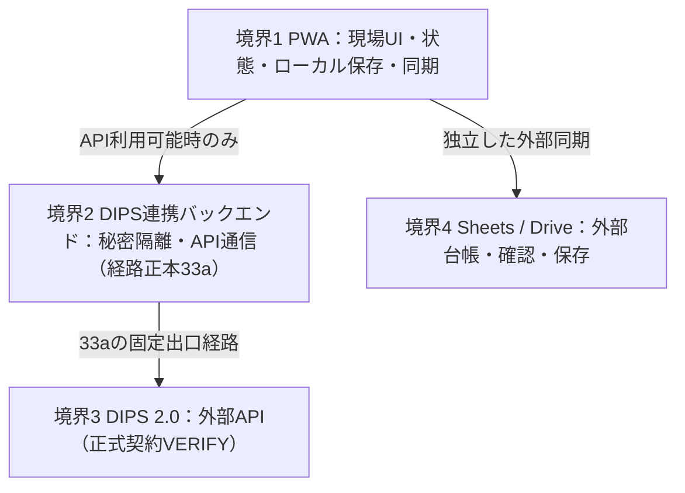

# 10. システム境界と責務分離設計（10_system-boundaries.md）

最終更新: 2026-09-18
プロジェクト: `drone-flight-ops`
フェーズ: Phase B2（詳細アーキテクチャ・実装前設計）

---

## 1. 全体アーキテクチャ境界概要

本システムは、現場スマートフォン（iPhone / Android）単体での自律運航記録を最優先としつつ、将来の国交省DIPS 2.0連携およびGoogleスプレッドシートへの外部台帳同期を安全に行うため、明確な4つの責務境界を設定します。

旧Workers経路の採用理由と固定IP要件による変更は[33a](dips-infrastructure/33a_fixed-egress-and-api-connection.md)を詳細正本とする。この図はシステム間責務だけを示し、ネットワーク構成を重複定義しない。

---

## 2. 各コンポーネントの厳格な責務分離

### 2.1 クライアント層（Frontend / PWA）の責務
- **主要責務**:
  1. **現場操作UIの提供**: 強い日差しの屋外でも視認性の高い、片手タップ・手袋タップ可能な高コントラストUI。
  2. **運航状態マシン（Operation State Machine）の実行**: 準備〜日常点検〜離陸〜着陸〜BAT交換〜機体交代〜飛行後点検〜運航確定の進行。
  3. **ローカルファースト永続化**: 通信状態に関わらず、全ての入力・打刻イベントをローカルDB（IndexedDB）へ即時保存。
  4. **地図・飛行範囲（FlightArea）管理**: Phase C5開始時に実機比較して選ぶ描画ライブラリ（Leaflet / MapLibre GL JS等、[17](17_map-and-airspace.md)）による、利用条件に沿った地理院地図タイルの描画、円・多角形ポリゴン・線形バッファの作成・編集、中立な `FlightAreaGeometry` のドメイン保持（地図描画ライブラリ向けには内部アダプターでGeoJSON変換、ユーザー向け地図出力としてはKMLを生成）。
  5. **同期キュー（SyncQueue）の管理**: DIPS通報やスプレッドシート送信ジョブ（運航日誌・DIPS飛行計画台帳）の生成、状態追跡、オフライン時の待機、再試行。
  6. **帳票およびGeoエクスポート**: 国交省取扱要領に基づく飛行日誌PDF/CSVのブラウザ内生成、および Google My Maps 連携用 KML エクスポート・Google Drive への自動保存（[出力境界](output/27_output-boundaries.md)、[KML](output/27a_kml-export.md)、[Drive](output/27b_google-drive-storage.md) 参照）。
  7. **DIPS手動入力支援機能**: API未利用時でもDIPS Web/Appへ素早く正確に転記できるよう、提出項目の一覧表示・ワンタップクリップボードコピー・DIPS Web起動導線を提供。
  8. **提出前台帳保存**: DIPSへ実際に通報（または手動入力）する前に、提出予定内容の不変スナップショットをローカルへ先行保存し、外部台帳への非同期同期ジョブを登録する。Sheets同期完了はDIPS通報の前提にしない（[24a](dips-submission/24a_submission-and-sheets-ledger.md)）。
- **クライアント層が「やってはならないこと」**:
  - DIPS APIの `client_secret` やマスター認証資格情報の直接保持。
  - 固定送信元IP・秘密情報の境界を迂回するDIPS API直接通信。根拠は33aと[16](16_security.md)であり、未確認のCORS／PKCEを許可条件・禁止理由として確定しない。
  - 通信待ちによるUI操作のブロッキング（オフラインファースト原則）。

### 2.2 DIPS連携バックエンド境界の責務

- **主要責務**: DIPS API秘密情報の隔離と、登録する固定送信元IP経路によるDIPS通信。Google Cloud上の限定バックエンドとCloud NATの役割・旧方式からの因果は[33a](dips-infrastructure/33a_fixed-egress-and-api-connection.md)。認証フロー・Token Endpoint・Cookie・実行コンピュートをこの責務要約から確定しない。
- **担当しない責任**: 現場の直接状態制御、全利用者の運航データの中央DB化、API障害時のアプリ起動停止。必要最小限の一時状態まで禁止する意味ではなく、保持方式は[16](16_security.md)のPENDING。
- **送受信境界**: 秘密の過剰返却を防ぐ規則は16。API電文の意味変換・Mapper・DTOは[25c](dips-flight-plan/25c_api-payload-mapping.md)であり、バックエンド／ネットワーク文書に別のpayload正本を置かない。Manual独立と結果不明時の安全境界は[33b](dips-infrastructure/33b_api-availability-and-retry-boundaries.md)。

### 2.3 DIPS Adapter境界の責務
- **主要責務**:
  - **通報方式の論理抽象化（Pluggable Adapter）**:
    - `ManualDipsAdapter`: DIPS API不要の完全自律手動通報アダプター（手動入力支援画面表示・パイロットの通報完了記録受付・DIPS計画番号手動入力）。
    - `MockDipsAdapter`: オフライン開発・シミュレーション用モックアダプター（擬似受付番号発行）。
    - `ApiDipsAdapter`: 将来API利用承認・credential取得時にのみ有効化されるAPIアダプター。中継経路は33a、正式認証契約はVERIFY。
  - 3つのアダプターを同一の `IDipsSubmissionAdapter` インターフェースで統一し、アプリ本体のデータモデルやUIが特定の提出経路に依存しない防波堤（Anti-Corruption Layer）を確立。
  - DRS／FPA／FPRの業務・外部契約差分を吸収。旧調査の具体realmは15のHISTORICAL / EVIDENCE/EXAMPLEであり、正式契約への再照合はVERIFY。
- **DIPS Adapterが「やってはならないこと」**:
  - DIPS通報結果をもって、アプリ全体として「飛行可能」と断定すること。
  - API非承認時にアプリの機能全体を停止させること（必ずManualDipsAdapterへフォールバックすること）。

### 2.4 外部台帳・確認境界（Google Spreadsheet等）の責務
- **主要責務**:
  1. **人間の確認・手修正の受容**: パイロットがPCやスマホから直接スプレッドシートを開き、記録の目視点検や手動補記（気象所感、備考、バッテリーコンディション追記）を行える透明性の提供。
  2. **累積計算の継続**: 機体累計飛行時間、バッテリー個体別生涯サイクル数等の数式計算の維持。
  3. **長期保管・原本性担保**: 端末紛失・破損・ストレージ自動削除から隔離した外部確定台帳。不変提出Snapshotと手動補記できる台帳メタデータを区別し、全量DBバックアップと同一視しない（[11](11_data-authority.md)、[24a](dips-submission/24a_submission-and-sheets-ledger.md)）。
  4. **DIPS飛行計画台帳の恒久保管**: DIPS側のデータ保存期間や参照制限に依存せず、「いつ、誰が、どの機体で、どのような範囲をDIPSへ通報しようとしたか／通報したか」を独立した台帳シートに履歴保存。
  5. **印刷・提示**: 国交省立入検査時や事業者監査時に即座に提出できる正式帳票フォーマットの提供。
- **スプレッドシート層が「やってはならないこと」**:
  - 現場での飛行打刻ごとのリアルタイム通信強制（現場では通信待ちをせず、運航終了後または電波復帰時に一括同期する）。

---

## 3. コンポーネント間連携インターフェース

各境界は疎結合なプロトコルで接続されます。

| 境界間 | プロトコル | 主なデータ形式 | 障害時のフォールバック |
|---|---|---|---|
| **Client ⇔ LocalDB** | IndexedDB API / Dexie.js | 内部TypeScriptオブジェクト | メモリ内保持（バルク移行時はSheets/CSVを第一候補とする） |
| **Client ⇔ Backend** | HTTPS (Fetch / REST) | JSON（認証・セッション詳細は16のVERIFY／PENDING） | 現場記録を継続。DIPS登録成否不明なら33bに従い自動再POSTしない |
| **Backend ⇔ DIPS 2.0** | HTTPS（正式認証契約VERIFY） | API JSON（25c正本） | 送出前失敗は待機。送出後の処理有無が不明なら [13b](state-machines/13b_dips-submission.md) の照合へ進み、自動再POSTしない |
| **Client ⇔ Spreadsheet** | HTTPS (Google Sheets API v4 / GAS WebAPI) | JSON (行配列・レコード) | 同期キューへ保持し、手動同期再試行可能 |

---

## 4. 将来のCapacitor（ネイティブラッパー）拡張境界

本システムはWeb標準技術（PWA）で構築しますが、将来的なiOS/Androidネイティブ化に備え、以下のブラウザ固有機能へのアクセスは**抽象化ポート（Ports & Adapters）**を介して呼び出します。

1. **Geolocation Port**: `navigator.geolocation` を直接叩かず、`ILocationService` を経由（Capacitor移行時は `@capacitor/geolocation` に差し替え可能）。
2. **Storage Port**: IndexedDB操作を `IStorageService` に集約（将来ネイティブSQLiteやファイルシステムへの退避が可能）。
3. **File Export Port**: `Blob` ダウンロード処理を `IFileExportService` に集約（将来ネイティブ共有ダイアログ `@capacitor/share` 等に差し替え可能）。

## 5. 詳細正本への接続

固定IP経路・限定責務は[33a](dips-infrastructure/33a_fixed-egress-and-api-connection.md)、API可用性と通信安全の因果は[33b](dips-infrastructure/33b_api-availability-and-retry-boundaries.md)。DIPS Adapter境界は [15](15_dips-adapter.md)、秘密・トークン・Sessionの全規則は [16](16_security.md)、Manual支援原則は [24](dips-submission/24_manual-submission.md)、画面VMは [25b](dips-flight-plan/25b_manual-web-mapping.md)、API電文は [25c](dips-flight-plan/25c_api-payload-mapping.md) が正本。Sheetsは確定台帳、Driveは生成ファイル保存という独立した外部責務であり、片方の障害で現場記録や他方を停止させない。
