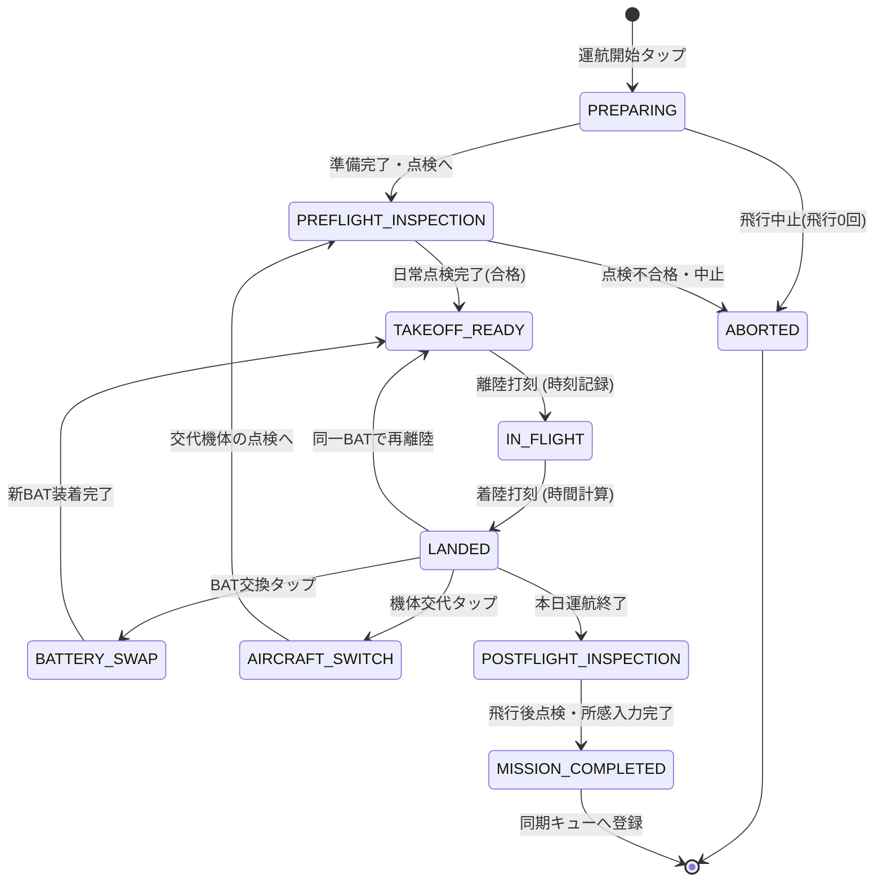
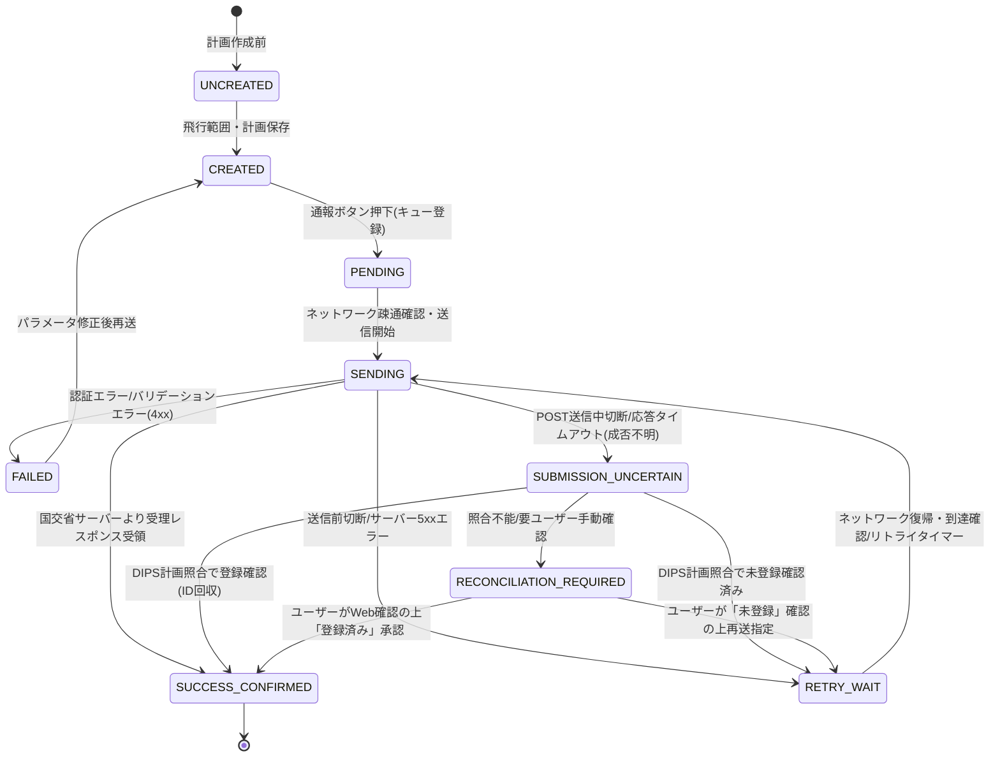

# 13. 運航状態マシンとDIPS通報状態マシンの設計（13_state-machines.md）

最終更新: 2026-09-14
プロジェクト: `drone-flight-ops`
フェーズ: Phase B2（詳細アーキテクチャ・実装前設計）

---

## 1. 2つの独立した状態マシンの分離原則

本システムでは、**「現場の実際の運航・飛行を管理する状態マシン」**と、**「国土交通省DIPS 2.0への手続きを管理する状態マシン」**を完全に分離して設計します。

```text
┌────────────────────────────────────────┐      ┌────────────────────────────────────────┐
│   運航状態マシン (Operation FSM)       │      │   DIPS通報状態マシン (DIPS FSM)        │
│                                        │      │                                        │
│  現場での物理的な作業・点検・飛行・交換 │ 独立 │  国交省サーバーとの電子的通報手続き    │
│  （通信不要・オフライン自律稼働）      │ ───  │  （通信依存・キュー管理・受付確認）    │
└────────────────────────────────────────┘      └────────────────────────────────────────┘
```

> [!IMPORTANT]
> **「DIPS通報成功確認済み」＝「飛行可能」ではありません。**
> DIPS通報の成功は飛行計画通報の法令要件を満たしたことを示すのみであり、実際の離陸には別途「許可承認の有効性」「空域の安全」「土地管理者承諾」「気象条件」「日常点検合格」の総合確認が必要です。

---

## 2. 運航状態マシン（Operation State Machine）

現場での操縦者の操作負荷を極小化し、現行アプリ（`autel-evo-lite-flight-log`）の俊敏な現場打刻フローを完全に継承・強化した状態遷移を定義します。

### 2.1 状態遷移図（Mermaid）



### 2.2 各状態の定義と現場操作

| 状態名 (State) | 説明・システム挙動 | 現場でのUI操作 | 保存されるデータ |
|---|---|---|---|
| **`PREPARING`** | 運航セッションの開始。機体・パイロット・現場天候・場所の確認。 | 機体選択、現場選択 | `Mission` レコード作成 |
| **`PREFLIGHT_INSPECTION`** | 航空法第132条の89、航空法施行規則第236条の84、および無人航空機の飛行日誌の取扱要領に基づく飛行前日常点検（航空法第132条の86の飛行前確認事項を含む）。 | チェック項目確認、「全項目正常」または異常メモ | `PreflightInspection` |
| **`TAKEOFF_READY`** | 離陸待機状態。画面中央に大きな「離陸」ボタンを配置。 | 片手タップで即離陸 | なし（画面待機） |
| **`IN_FLIGHT`** | 飛行中。ストップウォッチがカウントアップ。 | 画面中央に大きな「着陸」ボタン | `Flight` (離陸時刻) |
| **`LANDED`** | 着陸直後。飛行時間を自動計算表示。次アクション選択待機。 | 次飛行／BAT交換／終了 | `Flight` (着陸時刻・飛行時間) |
| **`BATTERY_SWAP`** | バッテリー交換。次スロットのバッテリーをワンタップ選択。 | BATボタン（1〜7）タップ | `BatteryUsage` 確定・切替 |
| **`AIRCRAFT_SWITCH`** | 機体交代。予備機または別機種へ切り替え。 | 機体選択タップ | `AircraftSwitch` 記録 |
| **`POSTFLIGHT_INSPECTION`** | 運航完了後の日常点検、機体清掃、総所感入力。 | 点検チェック、所感入力 | `PostflightInspection` |
| **`MISSION_COMPLETED`** | 本運航セッション確定。ローカル確定マーク付与。 | 「台帳同期」ボタン表示 | `Mission` (確定状態・同期ジョブ) |
| **`ABORTED`** | 天候悪化や機体異常による飛行0回での現場中止。 | 中止理由選択 | `Mission` (中止記録) |

### 2.3 特殊シナリオへの対応
1. **8回以上の連続飛行**: 配列構造として `Flight` を保持するため、8回、10回などの複数回飛行でも制限なく記録可能。
2. **日跨ぎ飛行**: 日時フィールドをISO8601（UTC+オフセット、秒・ミリ秒精度）で保持し、日付変更線を跨ぐ運航でも正確に飛行時間を算出。
3. **不意の強制終了・再起動**: すべてのイベント（離陸打刻、着陸打刻等）がIndexedDBに即時同期されるため、飛行中にブラウザが閉じても、再開時に直前の状態（`IN_FLIGHT` 等）へ確実に復帰。

---

## 3. DIPS通報状態マシン（DIPS Notification State Machine）

国土交通省DIPS 2.0への飛行計画通報プロトコルを反映し、通信切断やレスポンス未達による二重通報事故を防止する「結果不明・照合（Reconciliation）」状態を含む状態追跡を行います。

### 3.1 状態遷移図（Mermaid）



### 3.2 各状態の定義と挙動

| 状態名 (State) | 説明 | ユーザーへのUI表示 | 次の遷移 |
|---|---|---|---|
| **`UNCREATED`** | 飛行計画データが未作成。 | 「飛行計画を作成してください」 | `CREATED` |
| **`CREATED`** | 端末内に飛行範囲（円/ポリゴン）・日時が保存された状態。 | 「DIPS通報待ち（ローカル保存済）」 | `PENDING` |
| **`PENDING`** | パイロットが通報を要求し、同期キューに入った状態（オフライン含む）。 | 「通報待機中（通信可能時に送信）」 | `SENDING` |
| **`SENDING`** | バックエンド（Workers）経由でDIPS Token/FPRエンドポイントと通信中。 | 「DIPS通報中...（通信中）」 | 成功時/失敗時/結果不明時 |
| **`SUBMISSION_UNCERTAIN`** | POSTリクエスト送出後に切断・タイムアウトが発生し、DIPS側での登録成否が不明な状態。**自動再POSTは絶対に行わない**。 | 「通報結果確認中...（二重登録防止のため照合中）」 | DIPS計画検索による照合結果へ |
| **`RECONCILIATION_REQUIRED`** | DIPS計画検索でも登録成否を自動判別できず、手動確認が必要な状態。 | 「要確認: DIPS登録状況を照合できません。DIPS Web画面等で確認してください」 | ユーザー確認アクション |
| **`SUCCESS_CONFIRMED`** | DIPSサーバーから計画ID・受付番号が正常に返却された状態（または照合により確認）。 | **「DIPS通報成功確認済み（受付番号: XXXXX）」** | 完了 |
| **`FAILED`** | 登録記号不一致や日付矛盾など、恒久的な拒否レスポンス（4xx）。 | 「通報失敗: エラー内容を表示（修正が必要）」 | `CREATED` |
| **`RETRY_WAIT`** | 圏外やDIPSサーバー一時障害による未送信状態。 | 「一時通信エラー: 再送待機中」 | `SENDING` |

> [!CAUTION]
> **UI表示における厳守事項**:
> `SUCCESS_CONFIRMED` となった場合でも、画面に「飛行可能！」のような過剰な表示は行わず、「DIPS飛行計画通報が完了しました（受付番号: XXXXX）。周囲の安全・許可条件を確認してください」という注意喚起UIを徹底します。
> また、`SUBMISSION_UNCERTAIN` 状態では、DIPS APIが利用側独自の `Idempotency-Key` ヘッダによる重複防止を保証していないため、**安易なPOST再送を行わず、必ずDIPS計画検索APIによる照合、またはパイロット自身による目視確認を介在させます**。
