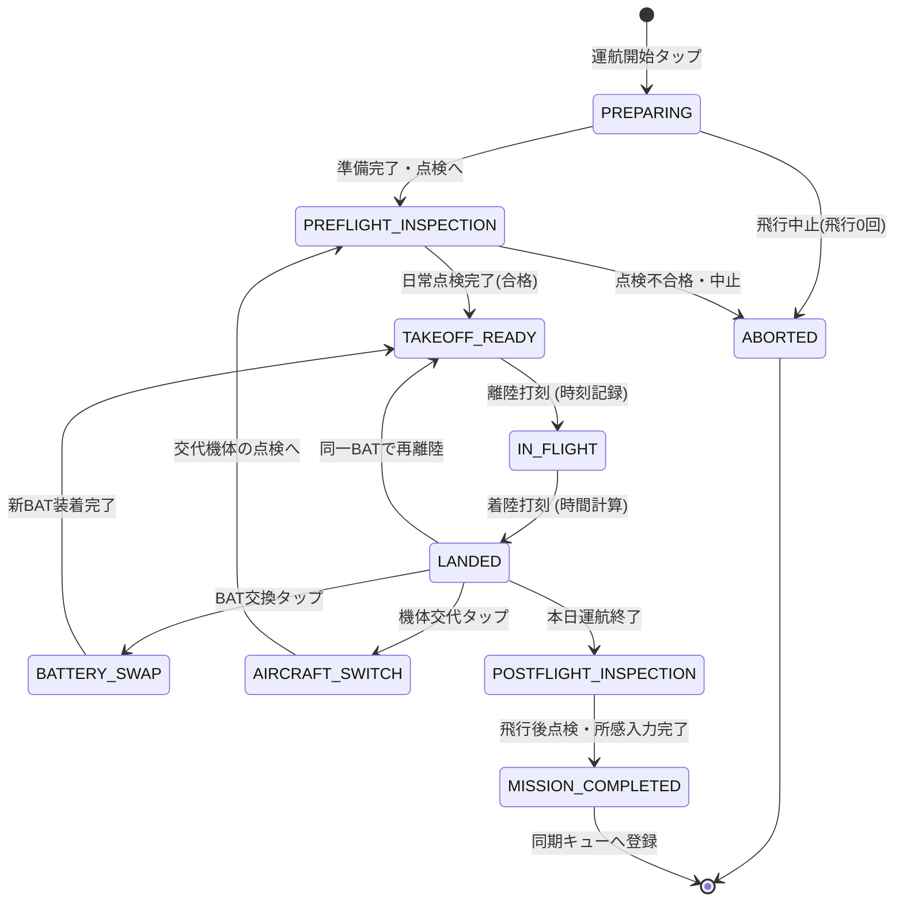
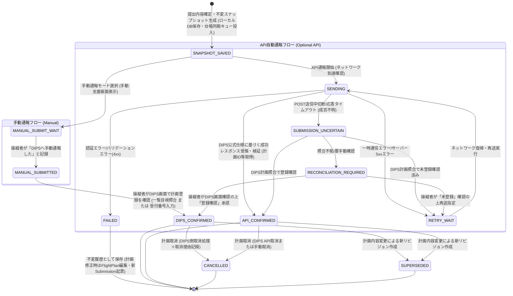

# 13. 運航状態マシンとDIPS通報状態マシンの設計（13_state-machines.md）

最終更新: 2026-09-14
プロジェクト: `drone-flight-ops`
フェーズ: Phase B2（詳細アーキテクチャ・実装前設計）

---

## 1. 2つの独立した状態マシンの分離原則

本システムでは、**「現場の実際の運航・飛行を管理する状態マシン」**と、**「国土交通省DIPS 2.0への手続きを管理する状態マシン」**を完全に分離して設計します。

```text
┌────────────────────────────────────────┐      ┌────────────────────────────────────────┐
│   運航状態マシン (Operation FSM)       │      │   DIPS通報状態マシン (DIPS FSM)        │
│                                        │      │                                        │
│  現場での物理的な作業・点検・飛行・交換 │ 独立 │  国交省サーバーとの電子的通報手続き    │
│  （通信不要・オフライン自律稼働）      │ ───  │  （通信依存・キュー管理・受付確認）    │
└────────────────────────────────────────┘      └────────────────────────────────────────┘
```

> [!IMPORTANT]
> **「DIPS通報成功確認済み」＝「飛行可能」ではありません。**
> DIPS通報の成功は飛行計画通報の法令要件を満たしたことを示すのみであり、実際の離陸には別途「許可承認の有効性」「空域の安全」「土地管理者承諾」「気象条件」「日常点検合格」の総合確認が必要です。

---

## 2. 運航状態マシン（Operation State Machine）

現場での操縦者の操作負荷を極小化し、現行アプリ（`autel-evo-lite-flight-log`）の俊敏な現場打刻フローを完全に継承・強化した状態遷移を定義します。

### 2.1 状態遷移図（Mermaid）



### 2.2 各状態の定義と現場操作

| 状態名 (State) | 説明・システム挙動 | 現場でのUI操作 | 保存されるデータ |
|---|---|---|---|
| **`PREPARING`** | 運航セッションの開始。機体・パイロット・現場天候・場所の確認。 | 機体選択、現場選択 | `Mission` レコード作成 |
| **`PREFLIGHT_INSPECTION`** | 航空法第132条の89、航空法施行規則第236条の84、および無人航空機の飛行日誌の取扱要領に基づく飛行前日常点検（航空法第132条の86の飛行前確認事項を含む）。 | チェック項目確認、「全項目正常」または異常メモ | `PreflightInspection` |
| **`TAKEOFF_READY`** | 離陸待機状態。画面中央に大きな「離陸」ボタンを配置。 | 片手タップで即離陸 | なし（画面待機） |
| **`IN_FLIGHT`** | 飛行中。ストップウォッチがカウントアップ。 | 画面中央に大きな「着陸」ボタン | `Flight` (離陸時刻) |
| **`LANDED`** | 着陸直後。飛行時間を自動計算表示。次アクション選択待機。 | 次飛行／BAT交換／終了 | `Flight` (着陸時刻・飛行時間) |
| **`BATTERY_SWAP`** | バッテリー交換。次スロットのバッテリーをワンタップ選択。 | BATボタン（1〜7）タップ | `BatteryUsage` 確定・切替 |
| **`AIRCRAFT_SWITCH`** | 機体交代。予備機または別機種へ切り替え。 | 機体選択タップ | `AircraftSwitch` 記録 |
| **`POSTFLIGHT_INSPECTION`** | 運航完了後の日常点検、機体清掃、総所感入力。 | 点検チェック、所感入力 | `PostflightInspection` |
| **`MISSION_COMPLETED`** | 本運航セッション確定。ローカル確定マーク付与。 | 「台帳同期」ボタン表示 | `Mission` (確定状態・同期ジョブ) |
| **`ABORTED`** | 天候悪化や機体異常による飛行0回での現場中止。 | 中止理由選択 | `Mission` (中止記録) |

### 2.3 特殊シナリオへの対応
1. **8回以上の連続飛行**: 配列構造として `Flight` を保持するため、8回、10回などの複数回飛行でも制限なく記録可能。
2. **日跨ぎ飛行**: 日時フィールドをISO8601（UTC+オフセット、秒・ミリ秒精度）で保持し、日付変更線を跨ぐ運航でも正確に飛行時間を算出。
3. **不意の強制終了・再起動**: すべてのイベント（離陸打刻、着陸打刻等）がIndexedDBに即時同期されるため、飛行中にブラウザが閉じても、再開時に直前の状態（`IN_FLIGHT` 等）へ確実に復帰。

---

## 3. DIPS通報状態マシン（DIPS Notification State Machine - B2.3改訂）

APIの有無（手動通報 / API自動通報）にかかわらず、提出予定スナップショットのローカル永続化、手動入力支援、送信成否、そして「操縦者による手動通報操作」と「DIPS側の登録確認」を明確に分離した状態追跡を行います。
また、**「DIPS通報状態（Submission State）」と「外部台帳同期状態（Ledger Sync State）」は直交する別軸として管理**し、スプレッドシート同期の完了有無がDIPS通報手続きをブロックしない設計とします。

### 3.1 状態遷移図（Mermaid）



### 3.2 各状態の定義と現場UI挙動

※飛行計画の作成・編集中は `FlightPlan.plan_status = 'draft'` で管理され、提出内容を確定して不変スナップショット（`payload_snapshot`）を生成した時点で初めて `DipsSubmission` が起票されます。したがって、Submission状態マシンは初期状態 **`SNAPSHOT_SAVED`** から始まります。

| 状態名 (State) | 説明 | ユーザーへのUI表示 | 次の遷移 |
|---|---|---|---|
| **`SNAPSHOT_SAVED`** | 提出不変スナップショット（`payload_snapshot`）が端末ローカルDBへ保存され、通報準備が完了した状態（同時に外部台帳同期キューへ投入）。※Google Sheets同期完了は待たない。 | **「通報準備完了（DIPS未通報）」** | 手動通報またはAPI通報へ |
| **`MANUAL_SUBMIT_WAIT`** | 手動入力支援画面を表示中。パイロットがDIPS Web/アプリへコピー＆ペースト入力を行っている待機状態。 | 「手動通報待機中（DIPSへ入力してください）」 | `MANUAL_SUBMITTED` |
| **`MANUAL_SUBMITTED`** | 操縦者がアプリ上で「DIPS手動通報を完了した」と記録打刻した状態。**※DIPS側の登録・受理確認ではない**。 | **「手動通報実施を記録（DIPS登録確認待ち）」** | `DIPS_CONFIRMED` |
| **`DIPS_CONFIRMED`** | 操縦者がDIPS画面で計画登録を確認した状態（飛行計画一覧との目視照合、または受付番号の確認入力）。 | **「DIPS通報確認完了（手動確認済）」** | 運航完了 / 取消 / 訂正 |
| **`SENDING`** | バックエンド経由で国交省DIPS APIとHTTP通信中。 | 「DIPS API通報中...（通信中）」 | 成功/失敗/結果不明 |
| **`API_CONFIRMED`** | DIPS公式API仕様で定義された成功レスポンスを受領し、受付番号/計画ID等の必要条件がシステム的に自動確認された状態。 | **「DIPS通報完了（API自動受理・受付番号: XXXXX）」** | 運航完了 / 取消 / 訂正 |
| **`SUBMISSION_UNCERTAIN`** | API送出後に通信切断・タイムアウトが発生し、登録成否が不明な状態。**自動再POSTは行わない**。 | 「通報結果照合中...（二重登録防止のため照合中）」 | DIPS計画検索照合へ |
| **`RECONCILIATION_REQUIRED`**| API照合でも成否を判定できず、操縦者によるDIPS Web画面での目視確認を要求する状態。 | 「要確認: DIPS登録状況を照合できません。DIPS画面で確認してください」 | 操縦者の確認入力 |
| **`FAILED`** | バリデーションエラーや恒久拒否（4xx）。不変履歴としてそのまま保存（下書きへの巻き戻しやpayload改変は不可）。 | 「通報失敗: 計画を修正して再作成してください」 | 履歴保存（FlightPlan修正・新Submission起票へ） |
| **`RETRY_WAIT`** | 通信圏外やDIPSサーバー障害による一時待機。 | 「一時通信エラー: 再送待機中」 | `SENDING` |
| **`SUPERSEDED`** | 時間変更や機体変更により、新しいリビジョンが起票され、旧提出スナップショットが無効化された状態。 | 「旧版（リビジョン更新により差し替え済み）」 | 履歴保持のみ |
| **`CANCELLED`** | 当該飛行計画を取り消した状態（DIPS側取消手続きと取消日時・理由記録）。 | 「計画取消済み（取消理由: XXXXX）」 | 履歴保持のみ |

> [!IMPORTANT]
> **状態と法的解釈の混同防止原則（5大ルール）**:
> 1. **「SNAPSHOT_SAVED（スナップショット保存済）」≠「DIPS通報済み」**: 端末ローカルDBやスプレッドシート台帳に保存されても、DIPSへは未提出です。また、台帳同期状態（`sync_status`）とDIPS通報状態（`status`）は別軸として画面上も区別表示します。
> 2. **「MANUAL_SUBMITTED（手動通報記録）」≠「DIPS確認済み」**: パイロットがボタンを押しただけではDIPS側の登録証明にはならず、一覧照合目視確認または受付番号確認（`DIPS_CONFIRMED`）を別ステップとして要求します。
> 3. **「API_CONFIRMED」と「DIPS_CONFIRMED」の区別**: システム自動検証（API）か人間による目視確認（手動）かを監査ログ・台帳上で明確に識別可能とします。
> 4. **「MOCK成功」≠「実通報成功」**: 開発・テスト用のMock DIPS Adapterで成功しても、本番通報済みとは表示せず、「[MOCK] 疑似通報完了」と画面上明記します。
> 5. **「通報完了」≠「飛行可能」**: DIPS通報はいかなる状態であっても飛行許可そのものではありません。「飛行計画通報完了。飛行前に周囲の安全・気象・許可条件を必ず確認してください」と表示します。
