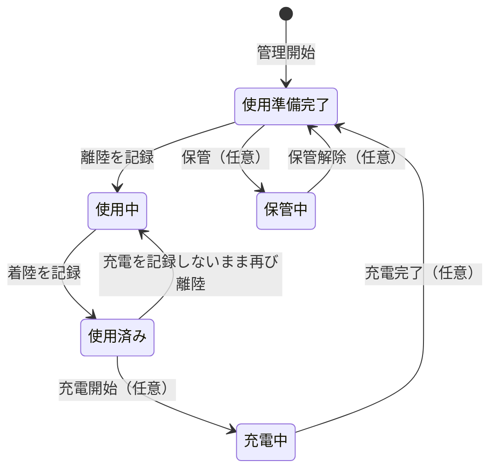

# 32d. BAT台帳の表示と状態の設計案（多数の機体・BATの共有運用）

最終更新: 2026-09-19\
状態: NEW-PROPOSAL（設計検討フェーズの設計案。オーナー確認待ち）。§2の前提は32b・12bのCURRENT-ACCEPTEDに従う。個別の`PENDING`は未確定\
主責務: BATの状態の見方、BAT台帳（一覧・詳細）と選択の画面、多数の機体・BATと複数ユーザー・組織での見せ方。BATが機体の固定所有でないこと・履歴の責任分離は[32b](32b_battery-sharing-and-acquisition-history.md)、属性は[12b](../domain-model/12b_aircraft-and-battery.md)、BAT交換の画面は[35b §7](../operation-recording/35b_normal-operation-and-final-save.md#7-bat交換の10項目)\
入口: [asset-management README](README.md)、着手の背景は[34f](../presentation/34f_screen-map-and-design-coverage.md)

## 1. 本書の位置づけ

2機7本の運用から、同型5機・BAT15本、さらに複数ユーザー・複数組織へ広げても、BATの状態が分かり、選ぶのが遅くならず、履歴が壊れないようにするための設計案。決まった仕様ではない。CURRENT-ACCEPTEDの物理保存・schemaも決めない（PENDING-S3-BATTERY-HISTORY・PENDING-C1-SCHEMAに従う）。実装は凍結中である。

## 2. 前提（既存の正本）

- BATは実物1本の独立した個体で、特定の機体の所有物にしない。型式との互換は機体型式とのN:M（32b §1）。
- 実際に使った機体・BAT・時間はFlightの明細、飛行以外の充電・保管・点検等はBatteryUsage（12b §6・§7、32b §4）。BAT交換だけで飛行実績を増やさない。
- 「機体セット別の表示」は見せ方であって所有ではない。03の途中案は`CURRENT-PROPOSAL`（32b §2）。
- 12bの`status`（ACTIVE／IN_USE／DISCHARGED／MAINTENANCE／RETIRED／DISPOSED）と、統合要件の保管・点検・劣化・紛失との対応は未確定（12b §8、PENDING-C1-SCHEMA）。

## 3. 状態を三つの軸で見る案

1本のBATについて、「まだ使えるか」「今どこにいるか」「健康か」は別のことである。一つの値に詰めると、たとえば「使用中で、かつ異常」を表せない。3軸で持ち、台帳の一覧には合成した1つの「表示状態」を出す。

| 軸 | 値の案 | 12bの既存値との関係（目安。対応は未確定） |
|---|---|---|
| 在籍（使えるか） | 使用可／退役／廃棄済み／紛失 | ACTIVE／RETIRED／DISPOSED。紛失に当たる値はない |
| 現況（今どこか） | 使用準備完了／使用中／使用済み／充電中／保管中 | IN_USE、DISCHARGED、充電・保管はBatteryUsageのCHARGE・STORAGE_MAINTENANCE |
| 健全性（健康か） | 通常／要観察／要点検／使用停止 | MAINTENANCE、`last_health_note`、DEEP_DISCHARGE_WARNING |

**表示状態の合成**: 在籍が使用可以外ならその値。使用可で健全性が使用停止なら「使用停止」、要点検なら「要点検」。それ以外は現況を出す。健全性の「要観察」は、現況の横に注意の印を添える。

**現況の遷移の案**（「任意」と付いた遷移は、利用者が記録した場合だけ起きる。それ以外は飛行の記録から自動で決まる）:

**記入支援の考え方**: 使用中・使用済みは、離着陸の記録から導けるので、利用者に追加入力を求めない。充電・保管・点検・異常は、利用者が記録した場合だけ反映する。記録しない運用でも、選択や飛行を止めない（[00_goal](../../00_goal.md)の現場ファースト）。

## 4. BAT台帳の画面の案

物理画面の数や名称は決めない。30の10項目規約に沿い、論理上の画面責任を示す。入口は［各種設定・管理］の中のBAT（PENDING-D-SETTINGS-SCREENS）。

### 4.1 BAT一覧

| 番号 | 記録項目 | 案 |
|---|---|---|
| 1 | 目的 | 全BATの現況と健全性を一目で見て、使う個体を決め、異常や不足に気づく |
| 2 | 入口・入れる条件 | ［各種設定・管理］のBAT。環境の選択が済んでいること。見る権限は31b |
| 3 | 表示情報 | 上部に現況別の件数。一覧は1本1行: 表示名、型式、表示状態、累計サイクル、累計飛行時間、最終使用（日時・機体）、今装着している機体 |
| 4 | 初期値・自動入力 | 並びの初期値は表示名順。絞り込みの初期値は「使用可」の全件 |
| 5 | 主操作・副操作 | 主: 行を選んで詳細へ。副: 現況・型式・互換機体・健全性で絞る、表示名で探す、任意の「機体セット」で並べる。登録・変更は未設計 |
| 6 | 操作後の遷移 | 行の選択で§4.2へ。戻るで［各種設定・管理］へ |
| 7 | 戻る・中止・削除 | 一覧からは削除しない。廃棄・退役は状態の変更で表し、履歴と累計は消さない |
| 8 | 保存・更新時点 | 表示のみ。状態の変更は詳細で行い、飛行由来の状態は保存済みの飛行記録から導く |
| 9 | 権限・online/offline差 | 権限は31b。offlineでは端末に取得済みの範囲を表示し、最新とは断定しない（[38a §4](../sync-and-cache/38a_shared-source-and-device-cache.md#4-正本を確認する時点とcacheの表示)） |
| 10 | 未確定 | 列の取捨、件数が多い場合の見せ方、セット表示の作り方（PENDING-D-BAT-SET-VIEW） |

### 4.2 BAT詳細と履歴

| 番号 | 記録項目 | 案 |
|---|---|---|
| 1 | 目的 | 1本のBATの状態・使用履歴・累計を確かめ、必要なら状態を記録する |
| 2 | 入口・入れる条件 | BAT一覧の行選択。BAT交換の選択画面からも参照できる |
| 3 | 表示情報 | 表示状態と3軸、型式・互換機体、取得時の状態（[32b §3](32b_battery-sharing-and-acquisition-history.md#3-中古batの取得時確認とその後の履歴)）、累計、直近の所感。下に時系列の履歴: 飛行での使用（日付・機体・場所・飛行時間）と、記録された充電・保管・点検・異常 |
| 4 | 初期値・自動入力 | 履歴は新しい順。飛行での使用は飛行の記録から表示し、二重に入力させない |
| 5 | 主操作・副操作 | 主: 状態の記録（充電・保管・点検・異常・使用停止・退役・廃棄）。副: 所感の追記、履歴の期間指定 |
| 6 | 操作後の遷移 | 記録後は詳細へ戻る。一覧へ戻る |
| 7 | 戻る・中止・削除 | 記録の取消は、履歴に「取り消した」事実を残す形にし、消さない案（監査の方針は[12f](../domain-model/12f_common-lifecycle-id-and-audit.md)） |
| 8 | 保存・更新時点 | 状態の記録は端末へ保護し、通信できるときにSheetsの台帳へ同期（[38b](../sync-and-cache/38b_confirmation-and-sync-timing-separation.md)）。誰がいつ記録したかを残す |
| 9 | 権限・online/offline差 | 記録できる人は31b。offlineでも記録でき、同期待ちの表示を付ける |
| 10 | 未確定 | 使用停止のBATを選べなくするか（PENDING-D-BAT-STATES）、履歴の物理保持（PENDING-S3-BATTERY-HISTORY） |

### 4.3 BAT交換のときの選択（35b §7の個体選択UIの案）

現場で片手・手袋でも素早く選べることを優先する。

- 対象機体と互換のBATだけを出す。並びは、使用準備完了を上、次に最終使用が古いもの、使用停止は下に薄く表示（選べるかは未確定）。
- 各行に、表示名・現況・最終使用・累計サイクルを出す。表示名の一部入力で絞れる。
- 直前まで使っていたBATは、交換で外した個体として印を付ける。
- 充電を記録していない運用でも、使用済みのBATを選べないようにしない。

## 5. 規模別の見え方（帳票見本。すべて架空）

**例A: 2機・7本**（旧BAT_1〜7に近い規模）

| 表示名 | 型式 | 表示状態 | 累計サイクル | 最終使用 | 今の機体 |
|---|---|---|---:|---|---|
| BAT-01 | 型式X | 使用中 | 41 | 今日 | 機体A |
| BAT-02 | 型式X | 使用済み | 38 | 今日 | — |
| BAT-03 | 型式X | 使用準備完了 | 40 | 昨日 | — |
| BAT-04 | 型式X | 使用準備完了 | 12 | 3日前 | — |
| BAT-05 | 型式X | 保管中 | 5 | 2週間前 | — |
| BAT-06 | 型式X | 要点検 | 60 | 1週間前 | — |
| BAT-07 | 型式X | 使用準備完了 | 22 | 昨日 | — |

**例B: 同型5機・15本**。上部に現況別の件数を出し、絞り込みで必要な行だけを見る。

| 現況別の件数 | 使用中 | 使用済み | 充電中 | 使用準備完了 | 保管中 | 要点検・使用停止 |
|---|---:|---:|---:|---:|---:|---:|
| 15本の内訳 | 3 | 4 | 2 | 4 | 1 | 1 |

機体A〜Eのどれでも、互換のBAT15本から選べる。1本のBATが別の日に別の機体で使われても、同じ1行に履歴が積み上がる。機体ごとにタブや行を増やさない。「機体セット」は、利用者が付ける任意のグループ名（例: 「午前用」）で、並びや絞り込みのための見せ方に限る。

## 6. 利用シナリオ（表示の確認用）

1. **現場でBAT交換**: 着陸後に交換を選び、互換のBATから使用準備完了を選ぶ。外したBATは使用済みになり、選んだBATは使用中になる。
2. **同じ日に複数の機体で共用**: BAT-03を機体Aで使い、午後に機体Bで使う。詳細の履歴に2件が並び、累計サイクルと累計飛行時間は全機体の合算になる。
3. **中古BATの取得**: 取得時の確認サイクル数を記録して管理を開始する。取得前の履歴は推定せず、「取得時の状態」として区別して表示する。
4. **異常の発見**: 詳細で異常と使用停止を記録する。一覧の表示状態が使用停止になり、交換の選択でも見分けられる。履歴と累計は消えない。
5. **廃棄**: 詳細で廃棄済みを記録する。一覧の既定の絞り込み（使用可）から外れるが、履歴と過去の飛行での使用は残る。

## 7. 複数ユーザー・複数組織

- BATの台帳は運用環境ごとの`03_バッテリー管理`に置く（[37](../drive-structure/37_environment-storage-responsibilities.md)）ため、BATは環境（[31a](../identity-and-access/31a_person-account-and-environment.md)）に属し、その環境の利用者の間で共有する。複数人が同時に見ても、1本のBATは1行のまま。
- 状態を記録できる人は[31b](../identity-and-access/31b_roles-and-access-control.md)に従う。誰がいつ記録したかを残す（[12f](../domain-model/12f_common-lifecycle-id-and-audit.md)）。
- 離任した人が記録した履歴は残す（[31d](../identity-and-access/31d_membership-lifecycle.md)）。
- 環境をまたぐBATの貸し借りや移管は設計していない（PENDING-D-BAT-CROSS-ENV）。

## 8. 未確定・オーナー確認事項

- **PENDING-D-BAT-STATES**: §3の軸と値が業務に合うか。決める点: (1) 充電・保管を記録する運用にするか（任意で記録する案）、(2) 状態に「紛失」を含めるか、(3) 使用停止のBATを交換の選択で選べなくするか、警告にとどめるか。12b §8のPENDING-C1-SCHEMAへの回答の方向（複数の軸に分ける案）であり、保存値は決めない。
- **PENDING-D-BAT-SET-VIEW**: 「機体セット」の表示が5機15本でも必要か。必要なら、利用者が作る任意のグループにするか、自動（最近使った機体別）にするか。
- **PENDING-D-BAT-CROSS-ENV**: 環境をまたぐ貸し借り・移管の運用があるか。
- 既存のまま維持: PENDING-S3-BATTERY-HISTORY、PENDING-C1-SCHEMA、35bのBAT交換の個体選択UI・schema。

**再検討条件**: 実際のBAT運用（本数、充電の記録の有無、共有の範囲）が本書の前提と合わない場合、オーナーが状態の軸や値を変える場合。
