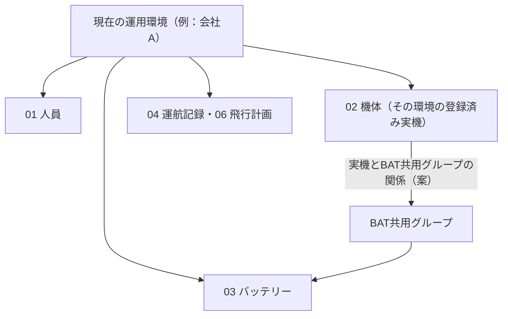
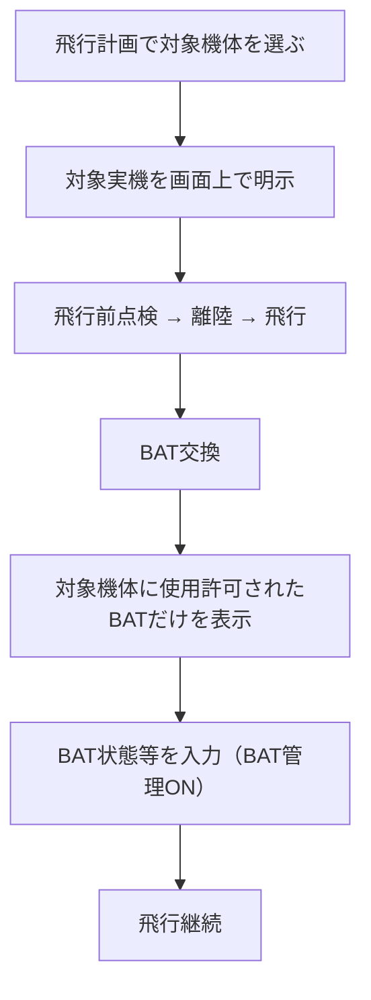

# 32h. 運用環境・登録機体・BAT共用グループの関係（02機体管理と03バッテリー管理の接続）

最終更新: 2026-09-20\
状態: 環境に属するデータの連鎖、環境切替、Googleアカウントの扱い、BAT管理が機体単位の任意であることは、既存の設計ベースライン（CURRENT-ACCEPTED）への接続。登録済み実機の02での管理、実機とBAT共用グループの関係、使用許可機体、新しい機体を追加する流れ、紐付けのない機体でのBAT選択制限は、オーナーが検討中の方向としての現在案（CURRENT-PROPOSAL）。個別の`PENDING`は未確定\
主責務: 「どの運用環境の、どの登録済み実機が、どの物理BAT群を使用できるか」という関係の意味。BATの意味・共用・履歴は[32b](32b_battery-sharing-and-acquisition-history.md)、BAT管理の適用範囲は[32e](32e_battery-management-scope-and-flight-separation.md)、BATの保存構造は[32f](32f_battery-storage-structure.md)、現場入力は[32g](32g_battery-field-input.md)、機体の取得・累計は[32a](32a_aircraft-acquisition-and-cumulative-time.md)、環境・人物・権限は[31a〜31d](../identity-and-access/README.md)、画面は[34g](../presentation/34g_settings-aircraft-management-and-context-display.md)\
由来: オーナーの2026-09-20の検討内容（会話。ファイルではない）。実際のDriveは直接確認していない\
入口: [asset-management README](README.md)

## 1. 位置づけ

同じPWAを個人・会社・スクール・臨時業務などの運用環境で使い、環境ごとに機体とBATを持つ。機体を追加したとき、同じBATを使える機体を、BATのシートを直接書き換えずに、どう登録し、どうBATとの関係へ反映し、飛行の場でどのBATを選べるようにするか、という関係を保持する。

**新文書にした理由（Responsibility Check）**: この関係は機体（02）とBAT（03）の両方にまたがり、機体の取得・累計（32a）にもBATの保存構造（32f）にも収まらない。変更の契機（機体を追加した時）、参照する保存領域（02と03）、実装の時期（型はC1、選択候補はC3、同期はC4）が、既存文書のどれとも異なるため、新しい文書とした。

**用語**: 「BAT共用グループ」は、同じBATを共用できる機体系ごとの保存単位（[32f §3](32f_battery-storage-structure.md#3-現在の保存構造)、[ADR-0028](../../decisions/ADR-0028-battery-storage-by-shareable-aircraft-family.md)）を、実機との関係で呼ぶオーナーの呼称である。内部名称・schema名は決めない。現在の確認用構成では、EVO LiteとEVO Lite+が共用する7本のBATに当たる。グループと03のSpreadsheetの対応が1対1かは未確定（PENDING-D-AC-GROUP-NAMING）。

## 2. 運用環境に属するデータの連鎖（既存の原則との接続）

**既存の設計（CURRENT-ACCEPTED。維持する）**:
- OperationalEnvironmentは、個人・会社・スクール・臨時業務等、同じPWAで切り替えて使う運用環境で、環境ごとにroot／正本を切り替える（[31a §2](../identity-and-access/31a_person-account-and-environment.md#2-現在の概念境界とorganization)）。
- 同じ人物が複数の環境へ所属してよく、環境ごとに役割が異なってよい（31a §2）。
- 複数の環境に所属する場合は、現在どの運用環境を使っているかと環境を切り替える手段を画面で分かるようにし、必要なら使用中のGoogleアカウントも併記する。所属が1つだけなら、環境名や切替UIを常時表示しなくてよい（[31a §4](../identity-and-access/31a_person-account-and-environment.md#4-会社利用と環境切替へ詰めた内容)）。
- 通常起動時に前回使った環境を初期選択する案は、`CURRENT-PROPOSAL`のまま（[34a §5](../presentation/34a_setup-and-environment-entry.md#5-通常起動と環境選択の10項目)）。
- 環境を切り替えると、選択した環境のホーム・正本へ接続する（34a §5）。環境ごとに01〜07の責任領域を持つ（[37 §2](../drive-structure/37_environment-storage-responsibilities.md#2-0107の現在責任)）。

**今回の接続**: 機体管理・BAT管理も、現在選択している運用環境に属するデータとして扱う。

| 現在の運用環境 | その環境のデータ |
|---|---|
| 例: 会社A | 人員（01）、機体（02）、BAT（03）、飛行計画・運航記録（04・06）。環境を切り替えると、参照する機体・BAT・人員等の正本もその環境のものへ切り替わる |



**変えないこと**: 運用環境とOrganizationの同一性・関連の基数は未確定のまま（31a §2、PENDING-S2-IDENTITY）で、環境をOrganizationと同一視しない。Googleアカウントは、運用環境や人物そのものと同一視しない（31a §2）。ログイン方式やアカウントの切替方式は、今回新しく決めない。

## 3. 登録済み実機と02機体管理の責任（案）

**CURRENT-PROPOSAL**: その運用環境で使用する登録済み実機を管理し、BATとの利用関係を設定する責任を、02機体管理側へ持たせる方向で検討している。

- 扱う単位は「機種」ではなく、登録記号を持つ実際の1機のAircraftである（12b「実在する1機」。機種と実機の分離は[32a §1](32a_aircraft-acquisition-and-cumulative-time.md#1-型式と実機を分けた経緯)）。
- 例（実在の登録記号は書かない）:

```text
会社A
  ↓
02_機体管理
  ├─ EVO Lite+ / JU*********
  ├─ EVO Lite  / JU*********
  └─ その他の登録機体
```

- 02の既存の責任（機体と取得・管理情報。取得前の履歴と管理開始後の累計は32a）は維持する。今回加えるのは、環境で使う実機の登録と、BATとの使用関係の設定である。
- **PENDING-D-AC-REGISTRY-STORAGE**: 02機体管理の物理構成（Driveのフォルダー・Spreadsheetの数・シート・列）と、機体管理に持たせる全項目。今回は決めない（[37](../drive-structure/37_environment-storage-responsibilities.md)のPENDING-S6-DRIVE-PLACEMENT、32aのPENDING-S3-AIRCRAFT-HISTORYも解消しない）。

## 4. 実機とBAT共用グループの関係（案）

**CURRENT-PROPOSAL**: 次の関係で、02とBATの保存（03）を結ぶ。

```text
OperationalEnvironment（現在の運用環境）
       ↓
登録済みAircraft（02）
       ↓
BAT共用グループとの関係
       ↓
03_バッテリー管理（物理BAT1本につき1シート）
```

- **関係の単位**: 登録済みの実機と、BAT共用グループ（同じBATを共用できる物理BAT群）。1本ずつのBATではなく、グループとの関係で持つ。
- **関係を1か所に持つ**: どの登録済み実機が、どの物理BAT群を使用できるか、という関係を一元的に持つ。02側に責任を置く方向である。
- **BATシート上の一覧は正本ではない**: 各BATシート上部の「使用許可機体」（§5）は、この関係から生成・反映した、人が見るための表示とする。
- **BAT_1〜BAT_7へ人が手入力しない**: 2機を許可している場合に、7つのシート全部へ同じ実機の情報を7回入力・修正する方式にしない。新しい機体を追加した時に、30枚・50枚のBATシートを全部編集する構造にもしない。

**正本の区別**（32fの「同じ物理BATの履歴・現在状態・累計値の保存正本は、そのBATのシート1か所」は維持する。別の情報である）:

| 情報 | 正本 | BATシートでの扱い |
|---|---|---|
| 物理BATの履歴・現在状態・累計値 | 各BATのシート（32f §5） | 正本そのもの |
| 実機とBAT共用グループの関係（使用許可） | 02側（案） | 上部の「使用許可機体」は反映表示 |
| 互換機種（機種と、BAT型式の互換） | AircraftModel／BatteryCompatibility（[12b](../domain-model/12b_aircraft-and-battery.md)） | 上部に残すかは未確定（§5） |

## 5. 互換機種と使用許可機体（案・未確定）

現在の確認用BATシートの上部には、「EVO Lite / EVO Lite+ 共用」のような表示がある（EVIDENCE/EXAMPLE。オーナーの報告で、私は直接確認していない）。これは「どの機種で利用できるBATか」という機種レベルの情報である。今回、それに加えて、この運用環境で実際に使用を許可している登録済み実機を確認できる方がよいと考えている。

| 用語 | 意味 | 例 |
|---|---|---|
| 互換機種 | 製品仕様上・物理的に、そのBATを利用できる機種 | EVO Lite、EVO Lite+ |
| 使用許可機体 | この運用環境へ実際に登録され、このBAT共用グループとの使用関係を設定した実機 | EVO Lite+ / JU*********、EVO Lite / JU********* |

**表示のイメージ（案）**:

```text
使用許可機体
  EVO Lite+ / JU*********
  EVO Lite  / JU*********
```

これにより、「EVO Lite系なら何でも使える」ではなく、「この環境へ正式に登録し、BATとの関係を設定した実機で使用できる」ことが、人にも分かる。

**PENDING-D-AC-PERMITTED-DISPLAY**: 互換機種と使用許可機体を分けて扱う可能性がある。両方をBATシート上部へ残すか、使用許可機体だけで足りるか、互換機種はAircraftModel等の別の責任から参照するか、使用許可機体の最終の表示形式は、決めない。12bのAircraftModel／Aircraftの責任と合わせて整理する（32fのPENDING-D-BAT-SHEET-TOPに接続）。

## 6. 新しい機体を追加する流れ（案）

**CURRENT-PROPOSAL**: 同じBATを使える新しい機体を購入・追加した場合に、BATシートを直接編集して機体名を書き足す運用にはしない。まず機体登録から進める。

| 順 | 操作 | 意味 |
|---|---|---|
| 1 | ［各種設定・管理］を開く | 現在の運用環境の設定（[34g](../presentation/34g_settings-aircraft-management-and-context-display.md)） |
| 2 | ［機体管理］へ進む | 登録済み実機の一覧 |
| 3 | 新しい機体を登録する | その環境の登録機体へ加える |
| 4 | 機種・登録記号等を登録する | 登録記号を持つ実機として登録する |
| 5 | BAT管理を利用するかを設定する | ON／OFF（§7） |
| 6 | 使用するBAT共用グループを設定する | BAT管理がONの場合 |
| 7 | BAT側へ使用許可機体として反映される | 各BATシート上部の表示へ反映（§4・§5） |

**例**: 新しく、同じBATを使えるEVO Lite+を購入した場合は、まず「EVO Lite+ / JU*********」をその運用環境の登録機体へ追加する。その後、この機体を、既存のEVO Lite／EVO Lite+用のBAT共用グループへ紐付ける。その結果として、BAT管理側の表示へ新しい実機が反映される。

## 7. BAT管理のON／OFFとの関係

**既存（CURRENT-ACCEPTED。維持する）**: BAT個体管理を利用するかどうかは機体単位で選べ、OFFの機体でも飛行記録・点検記録等の基本運用は完結できる（[32e](32e_battery-management-scope-and-flight-separation.md)、[ADR-0029](../../decisions/ADR-0029-battery-management-optional-per-aircraft.md)）。

**CURRENT-PROPOSAL**: 機体を登録する時、または機体設定から、BAT管理のON／OFFに相当する設定を持つ方向である。
- OFFの機体は、BAT個体管理を利用せず、通常の飛行記録・点検等を完結できる。BAT共用グループとの関係は要らない。
- ONの機体は、その機体が利用するBAT共用グループとの関係を設定する。

ON／OFFをどの画面で切り替えるか、変更した時に既存の履歴をどう扱うかは決めない（32eのPENDING-D-BAT-SWITCH）。

## 8. 飛行時のBAT選択候補（案）

**CURRENT-PROPOSAL**: BAT共用グループへ登録・紐付けされていない実機では、そのグループのBATをアプリ上で選択できないようにする方向で検討している。
- 現在の対象機体が、あるBAT共用グループへ登録されていれば、そのグループのBAT（例: BAT_1〜BAT_7）を選択候補にできる。
- そのグループへ登録されていない別の機体を選んでいる場合は、そのBATを選択候補に出さない。
- 目的は、間違ったBATの選択の防止、BAT履歴と実際の使用機体の整合、機体を追加した時に登録の手順を必ず通すこと。

**BAT交換画面への反映**: まず現在の対象機体を明示し（[34g §2](../presentation/34g_settings-aircraft-management-and-context-display.md#2-現在の運用環境の表示と対象機体の表示)）、その実機に使用を許可しているBATだけを、管理ラベルで選択候補にする（[35b §7](../operation-recording/35b_normal-operation-and-final-save.md#7-bat交換の10項目)、[32d §5.3](32d_battery-ledger-and-status-design.md#53-bat交換のときの選択35b-7の個体選択uiの案)）。BAT管理がONの場合は、現場入力の4項目（管理ラベル必須・サイクル数任意・状態確認必須・備考任意。[32g](32g_battery-field-input.md)）へつなぐ。BAT管理がOFFの機体では、個体BATの選択フローを強制しない。BAT交換画面のレイアウトは今後詰める。



**PENDING-D-AC-UNLINKED-EXCEPTION**: 誤って登録した時の解除、緊急時、例外的な使用、管理者による修正の扱いは、まだ検討していないため決めない。

## 9. 会社等の分業・権限との接続

既存の設計では、DIPS通報と実飛行は別の時点で行える。会社の事務担当者が新規飛行から飛行計画を作りDIPS通報まで進め、後から操縦者が飛行リストで通報済み計画を選び、DIPS通報内容を確認して飛行前点検へ進む（[31c §3](../identity-and-access/31c_operational-actors.md#3-さらに通報者と操縦者を分離した理由)、[34b](../presentation/34b_home-and-navigation.md)、[34c](../presentation/34c_shared-flight-worklist.md)、[34d](../presentation/34d_dips-accepted-and-plan-content.md)）。

**今回の接続（CURRENT-PROPOSAL）**: 機体管理・BAT設定も、複数人が関わる運用へつなぐ。事務担当者や管理担当者が権限を持っていれば、［各種設定・管理］から機体を登録し、BAT共用グループへ紐付ける操作を、飛行の前にまとめて行える構造が考えられる。飛行計画では、その環境に登録済みの機体を選ぶ（[25b](../dips-flight-plan/25b_manual-web-mapping.md)の登録済み機体の選択）。

**新しい権限ルールは作らない**: 「事務員なら必ず機体を追加できる」というルールは今回作らない。業務上の役割・アプリ機能権限・Google Driveの実アクセスの三層（[31b §2](../identity-and-access/31b_roles-and-access-control.md#2-現在の三層とgoogleアクセス)）を維持する。既存の設定変更の定め（操縦者またはアプリ管理者に許可し、記録者だけでは許可しない。31b §4）に機体管理の操作が含まれるか、事務担当者・管理者・操縦者が機体管理でそれぞれ何をできるかは決めない。

**PENDING-D-AC-PERMISSION**: 機体管理（登録・変更・BAT管理のON／OFF・BAT共用グループとの紐付け）の具体的な権限。31bのPENDING-S2-ACCESS-DETAILに接続する。

## 10. 未確定・ADR判断・再検討条件

**未確定**（本書が定義するもの）: PENDING-D-AC-REGISTRY-STORAGE（§3）、PENDING-D-AC-PERMITTED-DISPLAY（§5）、PENDING-D-AC-UNLINKED-EXCEPTION（§8）、PENDING-D-AC-PERMISSION（§9）、**PENDING-D-AC-GROUP-NAMING**: BAT共用グループの内部名称・schema名、およびグループと03のSpreadsheetの対応。

**他の文書が定義する未確定**: 機体一覧・追加・変更・BAT共用グループ設定の画面レイアウト（PENDING-D-AC-SCREENS）と対象機体表示の位置（PENDING-D-AC-CONTEXT-DISPLAY）は[34g](../presentation/34g_settings-aircraft-management-and-context-display.md)、環境切替UIの画面位置はPENDING-S2-ENVIRONMENT-UI（[31a](../identity-and-access/31a_person-account-and-environment.md)）、BAT管理のON／OFFを変更する画面と、変更時の既存履歴の扱いはPENDING-D-BAT-SWITCH（[32e](32e_battery-management-scope-and-flight-separation.md)）。

**ADR判断**: 新しいADRは追加しない。BATを機体の所有物にしないこと（[ADR-0007](../../decisions/ADR-0007-normalized-masters-and-business-reporting.md) §2.2）、BAT管理を機体単位の任意にすること（ADR-0029）、BATの保存を共用機体系ごとに持つこと（ADR-0028）、環境と所属・権限を分けること（[ADR-0016](../../decisions/ADR-0016-environment-membership-and-access-separation.md)）は、既存のADRで表現済みである。本書の内容は現在案の段階で、02の構成・名称・例外・権限が未確定のため、ADRとして独立に記録する時期ではない。現在案が設計ベースラインへ昇格した時に、ADR-0028への追補または新しいADRの要否を判断する。

**再検討条件**: 実運用で、機体の追加のたびに登録の手順を通すことが負担になる場合、BAT共用グループの境界が運用に合わない場合、環境をまたぐ機体・BATの扱いが必要になった場合。
