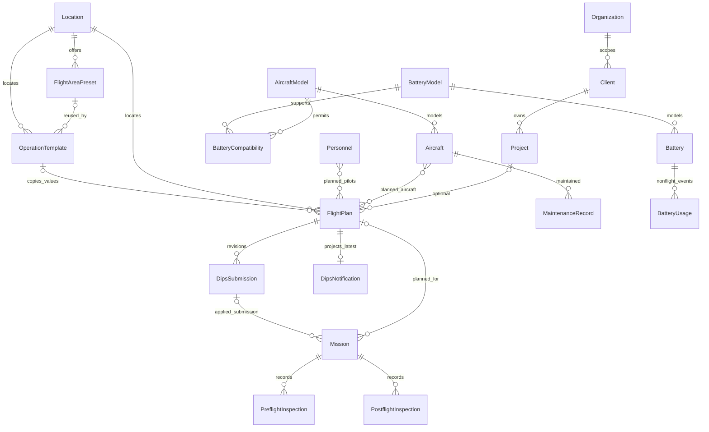

# 12. Domain Modelの全体構造と正本

最終更新: 2026-09-18\
状態: Phase C0完了・Phase C1未着手（docs再編）

主要責務: Entity間の関連と正本の所在。詳細型・外部仕様をここへ再集約しない。

## 1. 全体関連図（ER概要）

個人運用から法人フリートまで、Master / Preset / History / Projectionを分離する。共通分類と更新規則は [12f](12f_common-lifecycle-id-and-audit.md)、個別属性は領域文書を正本とする。

機体とバッテリーを所有関係で結ばない。実際に使用した組合せは飛行明細で保持し、型式互換をBatteryCompatibilityで表す。ERは全属性を複製する図ではない。独立管理するPermission / InsurancePolicy、発行履歴ReportSnapshot、変更履歴AuditEvent、設定AppSettingの属性は領域文書を参照する。SyncQueueは同期インフラ制御、DIPS Sheets台帳は提出記録の外部保持先であり、Domain Entityとの混在を避ける。

## 2. 正本と境界

- [12a](12a_organization-and-personnel.md): Organization / Client / Project、人物領域への接続。人物・アカウント・環境・所属・資格は[31a](../identity-and-access/31a_person-account-and-environment.md)、運航担当は[31c](../identity-and-access/31c_operational-actors.md)、権限・離任は同領域READMEから辿る。
- [12b](12b_aircraft-and-battery.md): AircraftModel / Aircraft / BatteryModel / BatteryCompatibility / Battery / BatteryUsage。
- [12c](12c_location-and-presets.md): Location / FlightAreaPreset / FlightPurposePreset / SafetyMeasurePreset / OperationTemplate。
- [12d](12d_flight-plan-and-dips.md): Permission / InsurancePolicy / FlightPlan / DipsSubmission / DipsNotification。
- [12e](12e_operation-inspection-maintenance.md): Mission / Flight / AircraftSwitch / PreflightInspection / PostflightInspection / MaintenanceRecord / ReportSnapshot。
- [12f](12f_common-lifecycle-id-and-audit.md): AuditEvent / AppSetting / 分類・更新・ID・冪等性・一括登録準備。
- [17](../17_map-and-airspace.md): FlightAreaGeometry、[13](../state-machines/README.md): 状態・離陸評価、[25d](../dips-flight-plan/25d_requirement-validation.md): DipsFieldRequirement。
- [11](../11_data-authority.md): Data Authority、[14](../14_offline-and-sync.md): SyncQueue、[24a](../dips-submission/24a_submission-and-sheets-ledger.md): Sheets Ledger、[18](../18_reports.md): Reports。

## 3. C1で読む範囲

C1のDomain schema / type・基本Repository設計は、本領域の該当Entityと12fを起点とし、関連する外部正本だけを読む。C1で複数組織UI、Bulk Import UI、API通信、Map editor、KML生成、Drive保存を追加実装しない。現フェーズの機能範囲は [23](../23_implementation-roadmap.md) が正本。

99.2 §0・§1の再移植により、読む順序とコード着手条件を区別する。[00_goalの記入支援目的](../../00_goal.md#11-記入支援を中心に置くまでの因果)から必要な記録・保存先・出力を確かめ、[23の開始ゲート](../23_implementation-roadmap.md#12-保存出力を確かめてから依存実装へ進むゲート)を満たした依存範囲だけを実装対象とする。型が既に文書化されていることだけで保存・出力の確認完了としない。正規化の理由は[ADR-0007](../../decisions/ADR-0007-normalized-masters-and-business-reporting.md)に保持し、Step 1ではEntityや§2以降の人物・機材の詳細設計を変更していない。

Step 2では99.2 §2に基づき人物・所属を具体化した。上図の旧`Organization → Personnel`を単一所属の現行制約として残さず、複数環境所属とOrganizationの未確定対応は[31a §2](../identity-and-access/31a_person-account-and-environment.md#2-現在の概念境界とorganization)へ委ねる。確定していないER基数を図へ追加しない。Step 2時点では§3以降の機材等は未移植だった。現在の各移管範囲は[architecture README](../README.md)を参照する。

Step 6では旧Mission→Flight／AircraftSwitchと機体・BAT→旧Flightの基数を現行ERから外した。旧候補属性は[12e](12e_operation-inspection-maintenance.md)、変更の因果と最終schemaの未確定は[35a](../operation-recording/35a_flexible-flight-and-details.md)に保持する。残るMission関連線も概念参照を示し、35aの最終schemaを先取りしない。
