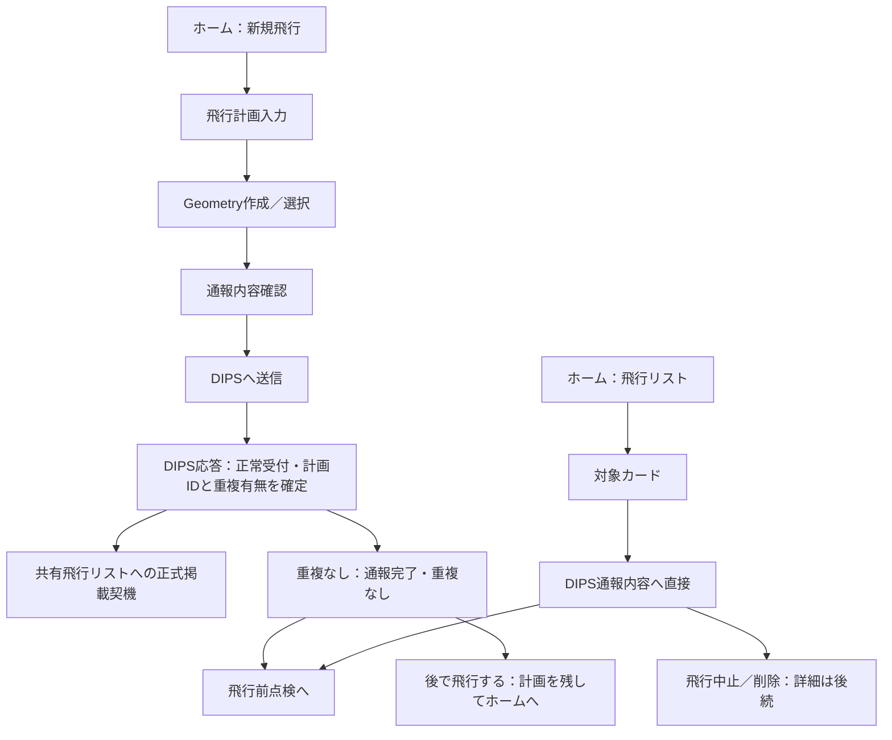

# 34d. DIPS正常受付後と通報内容の通常画面

最終更新: 2026-09-22\
由来: 99.2 §3と、§7の正常受付・共有リスト掲載・重複なし通常導線の部分。\
主要責務: 正式掲載の契機、正常受付後の選択、「DIPS通報内容」画面。API基盤・payload・全FSM・重複調整・取消詳細は対象外。

## 1. 受理確認をその後の作業選択へ接続した因果

**当初状態**: `0211a9a`の旧13は受理レスポンスから成功確認へ進み、受付番号等を表示する設計だった。基準[13b](../state-machines/13b_dips-submission.md)はその後、API成功確認、Manual確認、成否不明、外部台帳同期を分離した。これらの理由は維持するが、通報成功後に即飛行するか、後から別担当者が続行するかの具体画面までは表していなかった。

**問題・確認した根拠**: §3の通報と実飛行の時間差・担当差を画面へ接続する必要がある。99.2 §7には、2026-09-17にDIPSの飛行計画通報APIガイドラインの正常レスポンスを確認し、計画ID・登録結果・他計画との重複有無／件数、条件付きの重複情報を回収したという記録がある（EVIDENCE/EXAMPLE）。今回その原ガイドライン版や実API応答を再検証したものではない。

**検討・変更理由**: 送信ボタン押下は登録された証拠にならないため、送信開始と正常受付を区別する。また［後で飛行する］を掲載契機にすると、そのボタンを押すかどうかで、正常受付済みの計画が共有対象になる時点が変わる。原本は正常応答時点で掲載し、その後に今飛ぶか後にするかを選ぶ設計へ詰めている。

## 2. 現在の掲載契機と通常経路

**CURRENT-ACCEPTED**: DIPSから正常受付結果を受け、計画IDと重複有無を確定できた時点を、06側の共有飛行リスト用データへ正式に反映する契機とする。API送信開始時点でも［後で飛行する］押下時点でもない。正常受付かつ重複なしでは「通報完了・重複なし」を表示する。カード側の表示は[34c](34c_shared-flight-worklist.md)の責任で、内部状態enumをこの表示文言へ置換しない。

図は重複なしの通常画面と掲載契機の関係であり、外部書込みのtransaction順序や全FSMではない。**［後で飛行する］は掲載済み計画を共有リストに残してホームへ戻り、後から本人または別の権限ある利用者／端末が続行できるようにする操作**である。再POSTや新しい計画の作成ではない。

**失敗・独立性の境界**: 通信断で登録成否が不明なら通常の「通報済み」画面やリストへ混ぜない。理由・再送条件は[33b](../dips-infrastructure/33b_api-availability-and-retry-boundaries.md)に一元化する。正常受付の事実とDrive／Sheets書込み完了も別であり、掲載契機が到来しただけで他端末から即時に見えることまで保証しない。保存の独立軸は[24a](../dips-submission/24a_submission-and-sheets-ledger.md)／[14](../14_offline-and-sync.md)、共有反映・表示の具体方式は34cのPENDING-S5-LIST-DETAILに残す。

## 3. 正常受付・重複なし画面の10項目

| 番号 | 記録項目 | 現在の内容・未確定 |
|---|---|---|
| 1 | 目的 | 正常受付と重複なしを確認し、今から点検するか後で続けるか選ぶ |
| 2 | 入口・入れる条件 | 新規飛行のDIPS送信後。正常受付・計画ID・重複なしを確認できた通常応答。単なる送信開始や結果不明では入らない |
| 3 | 表示情報 | 「通報完了・重複なし」。受付ID等の詳細配置は未確定。通報完了を飛行可能の保証にしない（13b／13c） |
| 4 | 初期値・自動入力 | 対象計画と検証したDIPS応答を参照。未受領値や重複有無を推定で埋めない |
| 5 | 主操作・副操作 | 主操作は［飛行前点検へ］［後で飛行する］。追加ボタンは定めない |
| 6 | 操作後の遷移 | 前者は飛行前点検へ。後者は計画を共有リストへ残したままホームへ戻る |
| 7 | 戻る・中止・削除 | ［後で飛行する］は中止・削除ではない。この画面に取消の完全仕様を追加せず、その他の戻る操作は未確定 |
| 8 | 保存・更新時点 | §2の正常応答時点が共有リストへの正式掲載契機。どちらの主操作を選ぶかに掲載を依存させない。実Flightや飛行完了を自動作成しない |
| 9 | 権限・online/offline差 | API利用条件は[16](../16_security.md)のVERIFYを維持。後の続行には31bの権限が必要。受付後の通信断・共有反映表示の詳細はPENDINGで、結果不明と混同しない |
| 10 | 未確定 | 応答契約・検証項目の実仕様照合、詳細レイアウト、共有書込み失敗時表示。重複あり調整・取消・KMLは対象外 |

## 4. DIPS通報内容画面の10項目

対象は飛行リストから選択した通報済み計画の、重複なし通常系。カードから直接入る因果とローカル編集を置かない理由は[34c §4](34c_shared-flight-worklist.md#4-通報内容へ直接進みローカル編集を置かない理由)。新規飛行の送信前「通報内容確認」と、送信後の本画面を混同しない。

| 番号 | 記録項目 | 現在の内容・未確定 |
|---|---|---|
| 1 | 目的 | 選んだ計画のDIPS通報内容を確認して、実飛行前点検または中止側の操作へ進む |
| 2 | 入口・入れる条件 | ［飛行リスト］の対象カードから直接。汎用中間詳細画面は挟まない |
| 3 | 表示情報 | その計画の「DIPS通報内容」。全表示項目やpayloadをここで新規定義せず、既存計画・提出記録を参照。重複ありの調整詳細は対象外 |
| 4 | 初期値・自動入力 | 選択された計画と通報内容を引き継ぐ。現在マスターの変更を使って通報済み内容を黙って書き換えない（不変記録の既存正本12d） |
| 5 | 主操作・副操作 | ［飛行前点検へ］［飛行中止／削除］。ローカルだけを変える大きな［編集］ボタンを常設しない |
| 6 | 操作後の遷移 | 前者は飛行前点検へ。後者の取消API・取消不能時等の詳細遷移は後続。日時・場所等の変更／再通報も別処理として残す |
| 7 | 戻る・中止・削除 | 中止／削除ボタンの存在までを確定。リスト整理、DIPS取消、過去実績削除を同一操作として確定せず、戻り方・確認UIは未確定 |
| 8 | 保存・更新時点 | 表示は既存の通報内容を参照。点検以後の記録責任は34b §3。中止／削除の保存対象・順序は本Stepで先取りしない |
| 9 | 権限・online/offline差 | 権限ある利用者が続行する。本人以外・別端末も含むが、具体操作可否は31b。offlineの内容確認・cache鮮度・中止処理の詳細は未確定 |
| 10 | 未確定 | 詳細表示項目、戻る／中止確認、権限・offline表現、計画変更／再通報・取消・重複調整の後続設計 |

## 5. FSM・認証・後続設計へ残す境界

[13a](../state-machines/13a_operation.md)の現場状態と[13b](../state-machines/13b_dips-submission.md)の提出状態を統合しない。「飛行前点検へ」は点検を省略した離陸許可ではなく、[13c](../state-machines/13c_takeoff-readiness.md)の評価を維持する。既存のManual、通報対象外、結果不明時にも実際の現場記録を残す境界を、このAPI通常画面から変更しない。全体の接続Gateは[13_overview](../state-machines/13_overview.md)。

**PENDING-S5-ACCEPTED-UI**: 正常応答後・内容画面の未記載の表示、戻る操作、権限／offline差の具体化。**VERIFY-S5-RESPONSE-EVIDENCE**: 原本が記録する2026-09-17のガイドライン版と正常応答条件。正式API仕様・認証・credentialはStep 4のVERIFY-S4-API-CONTRACTを維持し、今回のUIで確定しない。

API payloadは[25c](../dips-flight-plan/25c_api-payload-mapping.md)、固定出口は[33a](../dips-infrastructure/33a_fixed-egress-and-api-connection.md)。重複あり時の具体調整、取消不能・予定時刻経過・事故／急病・通信不能時の取消・作業リスト自動整理、KML生成／保存／再送は後続へ残し、本書にFSMや通信処理を追加しない。取消・作業リスト整理の意味は後続のStep 7bで[24b §3](../dips-submission/24b_dips-plan-records-and-worklist-lifecycle.md#3-計画が作業対象でなくなる意味取消整理)へ配置した（正確な条件と重複あり調整は未確定）。

Step 6の点検以降の通常運航は[35b](../operation-recording/35b_normal-operation-and-final-save.md)へ接続する。本書の正常受付・共有掲載の因果を変更せず、後続操作の詳細をここへ複製しない。

## 6. 利用者向けの表示（2026-09-21）

正常受付・結果不明・重複ありなどの表示は、内部の状態名やFSMの語を使わず、問題・データ保護状態・次の操作の型で示す（[30 §4](30_screen-specification-standard.md#4-内部設計用語と利用者表示文言の分離)、[34h §6](34h_user-facing-wording-and-terminology.md#6-エラー表示の型)）。結果不明の例（案）: 「DIPSに登録されたかどうか分かりません。同じ内容を自動で送り直すことはしません。DIPS Webの一覧で登録されているか確認してください」（[33b](../dips-infrastructure/33b_api-availability-and-retry-boundaries.md)の、結果不明を通常の通報済みとして扱わず盲目的に再送しない境界を、利用者の言葉で示したもの）。通報の主操作は［アプリからDIPSへ送信する］［DIPS Webで通報する］とし、「Manual」「API」だけを主ボタンの名前にしない（[34h §7](34h_user-facing-wording-and-terminology.md#7-通報方式の表示)）。§4の画面名「DIPS通報内容」は設計書上の名称であり、利用者向けには「DIPSに通報した内容」のように直接分かる表示を案とする（PENDING-U-WORDING）。

## 7. 通常運航へ進めない結果のモック境界（2026-09-22）

オーナーの修正指示により、設計モックのDIPS対象飛行では、正常受付・重複なしだけに［飛行前点検へ］を表示する。重複・調整が必要な場合は結果画面で停止し、入力内容を保持する。飛行リストの通報内容からも通常運航へ抜けられないよう同じ条件を適用する。結果不明・送信エラーでも点検へ進めず、内容を保持して確認・訂正へ戻す。

これは停止を確認するCURRENT-PROPOSALであり、重複の解除条件や手動調整完了の仕様を作ったものではない。**PENDING-S7B-DUPLICATE-ADJUST**の再開方法・状態名・解除操作は未決。Manualの登録確認だけを重複なしの証拠とせず、このモックでは通常運航へのボタンを出さない。既存FSMの現場の事実記録・DIPS対象外の経路を廃止する判断ではなく、§5の境界は維持する。
