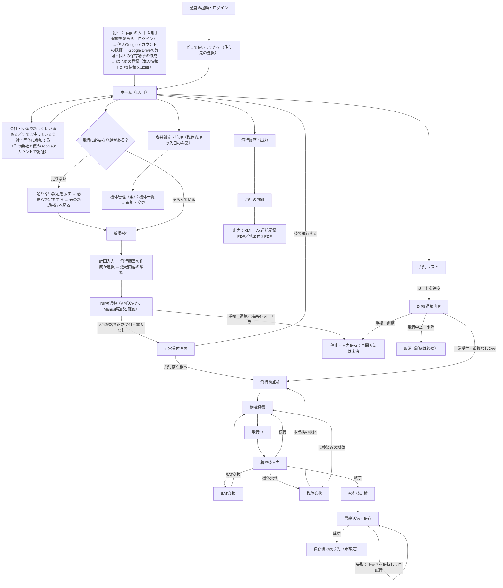

# 34f. 画面体系と遷移の俯瞰・設計の到達範囲

最終更新: 2026-09-22\
状態: 俯瞰の索引（既存の各画面仕様を並べたもの）。新しい画面仕様・業務ルールは決めない。未設計領域の`PENDING`と、進め方の`NEW-PROPOSAL`を含む\
主責務: アプリ全体の画面の並びと画面間の行き先、各画面の設計がどこまで進んでいるか、まだ設計されていない領域。各画面の中身と、画面ごとの遷移の正本は各画面仕様（項目6）\
入口: [Presentation設計の入口](README.md)

## 1. 本書の位置づけ

「ホームの次にどの画面へ進むのか」を一か所で追えるようにするための俯瞰。各画面の表示・操作・保存の詳細は、[30の10項目規約](30_screen-specification-standard.md)に沿った各画面仕様が正本で、本書は複写しない。行き先が本書と各画面仕様で食い違う場合は、各画面仕様を正とし、本書を直す。画面が増えたときは、先に各画面仕様、次に本書の順で更新する。

## 2. 画面の遷移（既存の正本から並べたもの）

図の各行き先の根拠は§3の正本。Manualで通報した計画が飛行リストへ入る条件は、API経路と同じとは決まっていない（PENDING-S5-MANUAL-LIST、[34c §5](34c_shared-flight-worklist.md#5-未確定と適用限界)）。図の「離陸」と「着陸」は、それぞれ離陸待機・飛行中の画面内の打刻で、独立した画面ではない（[35b §2](../operation-recording/35b_normal-operation-and-final-save.md#2-現在の論理画面順)）。

## 3. 画面ごとの到達範囲

| 画面・領域 | 設計の状態 | 正本 |
|---|---|---|
| 初回（アカウント・使い方の選択・作成／参加） | 作成／参加の区別の10項目あり。2026-09-21に入口の画面順と表示名を訂正した（案）。新しい入口の画面ごとの10項目は未記録（PENDING-S5-ENTRY-SCREENS）。必須登録範囲などもPENDING | [34a §4・§7](34a_setup-and-environment-entry.md#7-利用者向けの表示名と初回導線の訂正2026-09-21) |
| 通常起動・使う先の選択 | 10項目あり。専用画面かホーム内かはPENDING。利用者向けの表示は「どこで使いますか？」「個人で使用中」（案。34a §7.3） | [34a §5](34a_setup-and-environment-entry.md#5-通常起動と環境選択の10項目) |
| ホーム | 4入口の役割まで。10項目の画面仕様はない | [34b](34b_home-and-navigation.md) |
| 新規飛行（計画入力〜通報内容の確認） | Manual入力支援の画面とコピー導線は個別仕様がある（10項目の形式ではない）。飛行範囲の作成は機能の一覧まで。Manual／API共通の画面の流れは未整理 | [25b](../dips-flight-plan/25b_manual-web-mapping.md)、[17 §2.2](../17_map-and-airspace.md) |
| 正常受付（重複なし） | 10項目あり | [34d §3](34d_dips-accepted-and-plan-content.md#3-正常受付重複なし画面の10項目) |
| DIPS通報内容 | 10項目あり。取消の詳細は後続 | [34d §4](34d_dips-accepted-and-plan-content.md#4-dips通報内容画面の10項目) |
| 飛行リスト | 10項目あり。絞り込み・共有反映などの詳細はPENDING | [34c §3](34c_shared-flight-worklist.md#3-飛行リスト画面の10項目) |
| 飛行前点検、離陸待機、飛行中、着陸後入力、BAT交換、機体交代、飛行後点検、最終送信・保存 | いずれも10項目あり。物理画面数・保存後の戻り先・再送のUIは未確定 | [35b §3〜§10](../operation-recording/35b_normal-operation-and-final-save.md#3-飛行前点検の10項目) |
| 飛行履歴・出力 | 10項目あり。詳細画面・出力の実行画面・出力の単位は未確定 | [34e](34e_history-and-output.md) |
| 各種設定・管理 | 入口の意味と、機体管理の入口の流れ（案）まで。人員・BAT・場所・環境などの他の管理画面は未設計 | 34b、[34g §3](34g_settings-aircraft-management-and-context-display.md#3-各種設定管理から機体管理へ案)、下記PENDING-D-SETTINGS-SCREENS |
| 現在の運用環境と対象機体の表示 | 環境の表示・切替は既存（31a・34a）。対象機体の表示責任と対象画面を整理（案）。位置・固定表示は未確定 | [34g §2](34g_settings-aircraft-management-and-context-display.md#2-現在の運用環境の表示と対象機体の表示) |
| 利用者向けの表示名・文言（内部用語との分離） | 規約と対応表あり（個々の表示名は案。PENDING-U-WORDING） | [30 §4](30_screen-specification-standard.md#4-内部設計用語と利用者表示文言の分離)、[34h](34h_user-facing-wording-and-terminology.md) |
| 同期・オフライン・エラーの共通の表示 | 記録ごとの状態表示（[14 §3.4](../14_offline-and-sync.md)）と、鮮度の判断の方向（[38a §4](../sync-and-cache/38a_shared-source-and-device-cache.md#4-正本を確認する時点とcacheの表示)）はある。全画面に共通する見せ方は未設計 | 下記PENDING-D-STATUS-DISPLAY |

## 4. まだ設計されていない領域

コードを書かなくても決められる領域を、設計の対象として明示する。いずれも、既存のCURRENT-ACCEPTEDを変更せず、業務ルールを新たに決める場合はオーナーの確認を待つ。

- **PENDING-D-SETTINGS-SCREENS**: 各種設定・管理の画面体系（人員・機体・BAT・場所・プリセット・環境）。機体管理の入口の流れは[34g §3](34g_settings-aircraft-management-and-context-display.md#3-各種設定管理から機体管理へ案)（案）で、他の分類は未設計。ホームの4番目の入口から先の画面、一覧・登録・変更・状態の見せ方。既存の関連: 人員は[31](../identity-and-access/README.md)、機体・BATは[32b](../asset-management/32b_battery-sharing-and-acquisition-history.md)・[12b](../domain-model/12b_aircraft-and-battery.md)、内部分類はPENDING-S5-HOME-DETAIL（34b）。
- **PENDING-D-BAT-LEDGER**（オーナー方針を反映済み: BAT管理は機体単位の任意は[32e](../asset-management/32e_battery-management-scope-and-flight-separation.md)、保存は共用機体系ごとの1Spreadsheet・1物理BAT＝1シート・総合台帳なしは[32f](../asset-management/32f_battery-storage-structure.md)、現場入力は4項目は[32g](../asset-management/32g_battery-field-input.md)。表示の案は[32d](../asset-management/32d_battery-ledger-and-status-design.md)。未確定は各文書のPENDING）: 多数の機体・BATを共有して使う場合のBATの表示と状態、履歴、機体固定にしない共有運用、複数ユーザー・複数組織でも破綻しない管理。総合BAT台帳は置かず、一覧は各BATシートから導く表示にする。状態の値と導き方は業務ルールのため、オーナーが確認する（PENDING-D-BAT-STATES）。PENDING-S3-BATTERY-HISTORY（32b）に接続する。
- **PENDING-D-HUMAN-OUTPUT**: KMLに保存した内容を、人が閲覧・印刷するときの復元と構成。KMLの文字列を見せず、地図付きPDF・印刷物として、地図と通報情報をどう並べるか。PENDING-S7D-MAPPDF-DETAIL（[27f](../output/27f_derived-pdf-roles-and-map-pdf.md)）と、飛行履歴・出力のPENDING-S7D-HISTORY-*（34e）に接続する。
- **PENDING-D-NEW-FLIGHT-SCREENS**: 新規飛行の入力から通報内容の確認までの、Manual／API共通の画面の流れと、飛行範囲の作成画面。
- **PENDING-D-STATUS-DISPLAY**: オフライン・未同期・エラー・保存・確定・取消・戻るを、全画面で共通にどう見せ、どう操作するか。

## 5. 進める順序の案（NEW-PROPOSAL）

依存関係と、オーナーが挙げた優先の論点から、次の順を提案する。順序はオーナーが変えてよい。

1. **PENDING-D-BAT-LEDGER**（＋各種設定・管理のうち機体・BAT）: 3系統の優先記録の一つで、BAT交換の画面（35b §7）や飛行の明細（35a）の選択のしかたにも影響する。
2. **PENDING-D-HUMAN-OUTPUT**: 保存済みのKMLとA4記録を、人が使える形にする部分。BAT台帳とA4の出力を合わせて、帳票見本で確かめられる。
3. **PENDING-D-NEW-FLIGHT-SCREENS**: 通報までの入口。25bと17の画面を、ホームから通報内容の確認までの一本の流れにつなぐ。
4. **PENDING-D-STATUS-DISPLAY**: 1〜3の画面が揃ってから、共通の見せ方と操作を決める（先に決めると各画面の詳細に引きずられる）。
5. 残りの各種設定（人員・場所・プリセット・環境）と、飛行履歴・出力の詳細（34e）。

**適用限界**: 本書は設計の棚卸しで、実装の順序や着手を意味しない。C1を含む実装は、オーナーが明示的に実装開始を指示するまで凍結する。

## 6. モックで比較できる範囲の更新（2026-09-22）

新規飛行は[25b §7](../dips-flight-plan/25b_manual-web-mapping.md#7-スマートフォンの標準候補と比較案2026-09-22)のDIPS公式22項目順を標準候補とし、独自まとめ案を右側から比較できる。通常運航は[35b §12](../operation-recording/35b_normal-operation-and-final-save.md#12-旧現場uiを継承した設計候補2026-09-22)の旧現場UIを継承した候補へ更新した。どちらもCURRENT-PROPOSALで、PENDING-D-NEW-FLIGHT-SCREENS／PENDING-S6-OPERATION-UIは継続する。

通報結果と飛行リスト双方で、正常受付・重複なし以外は通常運航への接続を止める（[34d §7](34d_dips-accepted-and-plan-content.md#7-通常運航へ進めない結果のモック境界2026-09-22)）。停止後の調整・解除・再開方法は未決。画面の存在と製品仕様の確定を区別し、初回設定・DIPS情報保存・利用者文言のPENDINGも維持する。
