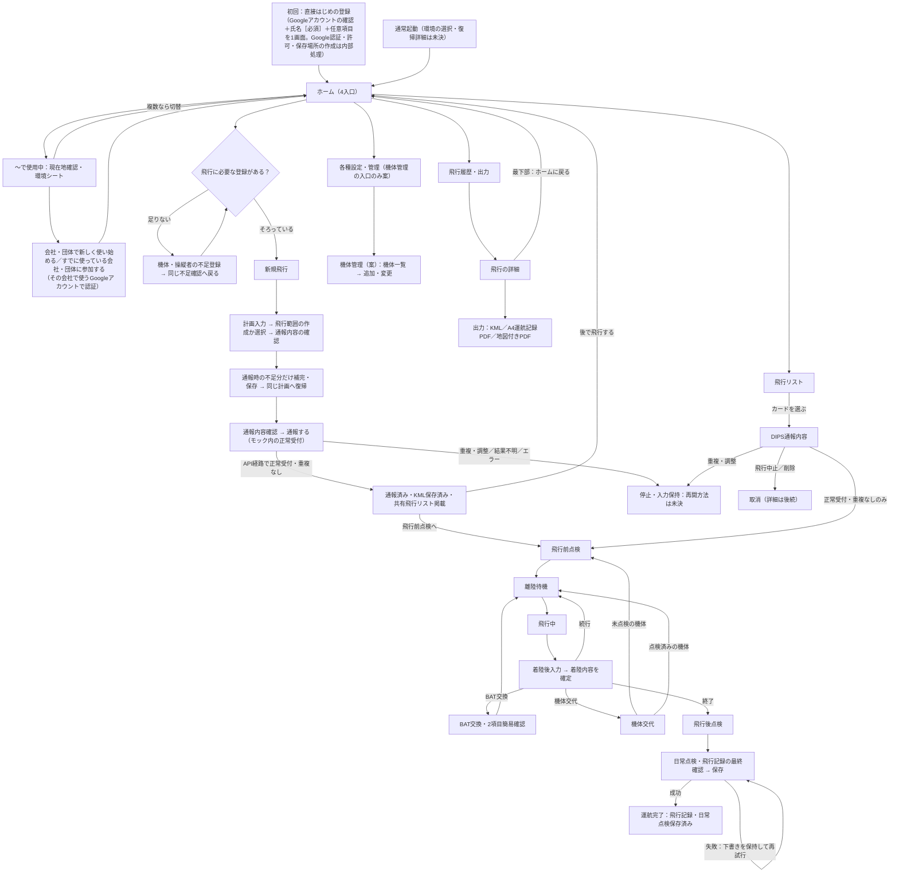

# 34f. 画面体系と遷移の俯瞰・設計の到達範囲

最終更新: 2026-09-25\
状態: 俯瞰の索引（既存の各画面仕様を並べたもの）。新しい画面仕様・業務ルールは決めない。未設計領域の`PENDING`と、進め方の`NEW-PROPOSAL`を含む\
主責務: アプリ全体の画面の並びと画面間の行き先、各画面の設計がどこまで進んでいるか、まだ設計されていない領域。各画面の中身と、画面ごとの遷移の正本は各画面仕様（項目6）\
入口: [Presentation設計の入口](README.md)

## 1. 本書の位置づけ

「ホームの次にどの画面へ進むのか」を一か所で追えるようにするための俯瞰。各画面の表示・操作・保存の詳細は、[30の10項目規約](30_screen-specification-standard.md)に沿った各画面仕様が正本で、本書は複写しない。行き先が本書と各画面仕様で食い違う場合は、各画面仕様を正とし、本書を直す。画面が増えたときは、先に各画面仕様、次に本書の順で更新する。

## 2. 画面の遷移（既存の正本から並べたもの）

図の各行き先の根拠は§3の正本。Manualで通報した計画が飛行リストへ入る条件は、API経路と同じとは決まっていない（PENDING-S5-MANUAL-LIST、[34c §5](34c_shared-flight-worklist.md#5-未確定と適用限界)）。図の「離陸」と「着陸」は、それぞれ離陸待機・飛行中の画面内の打刻で、独立した画面ではない（[35b §2](../operation-recording/35b_normal-operation-and-final-save.md#2-現在の論理画面順)）。

## 3. 画面ごとの到達範囲

| 画面・領域 | 設計の状態 | 正本 |
|---|---|---|
| 初回・会社追加／参加 | 初回は直接はじめの登録→ホーム。環境シート経由の会社追加・参加まで接続済み。未記載の10項目詳細はPENDING | [34a §9](34a_setup-and-environment-entry.md#9-初回は個人環境から始め初回登録を1画面にまとめる2026-09-23) |
| 通常起動・使う先の選択 | ホームの環境ボタンとシートは確定。起動時の選択・復帰詳細はPENDING | [34a §5・§9.6](34a_setup-and-environment-entry.md#96-複数環境と切替) |
| ホーム | 4入口と10項目あり。環境操作入口を上部ボタンに統合 | [34b](34b_home-and-navigation.md) |
| 新規飛行（計画入力〜通報内容の確認） | Manual入力支援の画面とコピー導線は個別仕様がある（10項目の形式ではない）。飛行範囲の作成は機能の一覧まで。公式22項目順・不足補完・確認・疑似通報まで接続済み（§7）。Manual側の不足補完と外部操作は未決 | [25b](../dips-flight-plan/25b_manual-web-mapping.md)、[17 §2.2](../17_map-and-airspace.md) |
| 正常受付（重複なし） | 10項目あり | [34d §3](34d_dips-accepted-and-plan-content.md#3-正常受付重複なし画面の10項目) |
| DIPS通報内容 | 10項目あり。取消の詳細は後続 | [34d §4](34d_dips-accepted-and-plan-content.md#4-dips通報内容画面の10項目) |
| 飛行リスト | 10項目あり。絞り込み・共有反映などの詳細はPENDING | [34c §3](34c_shared-flight-worklist.md#3-飛行リスト画面の10項目) |
| 飛行前点検、離陸待機、飛行中、着陸後入力、BAT交換、機体交代、飛行後点検、最終送信・保存 | いずれも10項目あり。運航完了までモック接続済み（35b §13）。製品の詳細配置・復旧・部分成功UIは未確定 | [35b §3〜§10](../operation-recording/35b_normal-operation-and-final-save.md#3-飛行前点検の10項目) |
| 飛行履歴・出力 | 10項目あり。詳細画面・出力の実行画面・出力の単位は未確定 | [34e](34e_history-and-output.md) |
| 各種設定・管理 | 入口の意味と、機体管理の入口の流れ（案）まで。人員登録のアカウント欄と本人編集は[34i](34i_person-registration-and-account-linking.md)で限定整理。他の管理画面・残りの詳細は未設計 | 34b、[34g §3](34g_settings-aircraft-management-and-context-display.md#3-各種設定管理から機体管理へ案)、下記PENDING-D-SETTINGS-SCREENS |
| 現在の運用環境と対象機体の表示 | 環境の表示・切替は既存（31a・34a）。対象機体の表示責任と対象画面を整理（案）。位置・固定表示は未確定 | [34g §2](34g_settings-aircraft-management-and-context-display.md#2-現在の運用環境の表示と対象機体の表示) |
| 利用者向けの表示名・文言（内部用語との分離） | 規約と対応表あり（個々の表示名は案。PENDING-U-WORDING） | [30 §4](30_screen-specification-standard.md#4-内部設計用語と利用者表示文言の分離)、[34h](34h_user-facing-wording-and-terminology.md) |
| 同期・オフライン・エラーの共通の表示 | 記録ごとの状態表示（[14 §3.4](../14_offline-and-sync.md)）と、鮮度の判断の方向（[38a §4](../sync-and-cache/38a_shared-source-and-device-cache.md#4-正本を確認する時点とcacheの表示)）はある。全画面に共通する見せ方は未設計 | 下記PENDING-D-STATUS-DISPLAY |

## 4. まだ設計されていない領域

コードを書かなくても決められる領域を、設計の対象として明示する。いずれも、既存のCURRENT-ACCEPTEDを変更せず、業務ルールを新たに決める場合はオーナーの確認を待つ。

- **PENDING-D-SETTINGS-SCREENS**: 各種設定・管理の画面体系（人員・機体・BAT・場所・プリセット・環境）。機体管理の入口の流れは[34g §3](34g_settings-aircraft-management-and-context-display.md#3-各種設定管理から機体管理へ案)（案）で、人員登録・本人編集のアカウント欄と引継ぎは[34i](34i_person-registration-and-account-linking.md)の限定範囲で確定し、他の分類・残りの詳細は未設計。ホームの4番目の入口から先の画面、一覧・登録・変更・状態の見せ方。既存の関連: 人員は[31](../identity-and-access/README.md)、機体・BATは[32b](../asset-management/32b_battery-sharing-and-acquisition-history.md)・[12b](../domain-model/12b_aircraft-and-battery.md)、内部分類はPENDING-S5-HOME-DETAIL（34b）。
- **PENDING-D-BAT-LEDGER**（オーナー方針を反映済み: BAT管理は機体単位の任意は[32e](../asset-management/32e_battery-management-scope-and-flight-separation.md)、保存は共用機体系ごとの1Spreadsheet・1物理BAT＝1シート・総合台帳なしは[32f](../asset-management/32f_battery-storage-structure.md)、現場入力は4項目は[32g](../asset-management/32g_battery-field-input.md)。表示の案は[32d](../asset-management/32d_battery-ledger-and-status-design.md)。未確定は各文書のPENDING）: 多数の機体・BATを共有して使う場合のBATの表示と状態、履歴、機体固定にしない共有運用、複数ユーザー・複数組織でも破綻しない管理。総合BAT台帳は置かず、一覧は各BATシートから導く表示にする。状態の値と導き方は業務ルールのため、オーナーが確認する（PENDING-D-BAT-STATES）。PENDING-S3-BATTERY-HISTORY（32b）に接続する。
- **PENDING-D-HUMAN-OUTPUT**: KMLに保存した内容を、人が閲覧・印刷するときの復元と構成。KMLの文字列を見せず、地図付きPDF・印刷物として、地図と通報情報をどう並べるか。PENDING-S7D-MAPPDF-DETAIL（[27f](../output/27f_derived-pdf-roles-and-map-pdf.md)）と、飛行履歴・出力のPENDING-S7D-HISTORY-*（34e）に接続する。
- **PENDING-D-NEW-FLIGHT-SCREENS**: 新規飛行の入力から通報内容の確認までの、Manual／API共通の画面の流れと、飛行範囲の作成画面。
- **PENDING-D-STATUS-DISPLAY**: オフライン・未同期・エラー・保存・確定・取消・戻るを、全画面で共通にどう見せ、どう操作するか。

## 5. 進める順序の案（NEW-PROPOSAL）

依存関係と、オーナーが挙げた優先の論点から、次の順を提案する。順序はオーナーが変えてよい。

1. **PENDING-D-BAT-LEDGER**（＋各種設定・管理のうち機体・BAT）: 3系統の優先記録の一つで、BAT交換の画面（35b §7）や飛行の明細（35a）の選択のしかたにも影響する。
2. **PENDING-D-HUMAN-OUTPUT**: 保存済みのKMLとA4記録を、人が使える形にする部分。BAT台帳とA4の出力を合わせて、帳票見本で確かめられる。
3. **PENDING-D-NEW-FLIGHT-SCREENS**: 通報までの入口。25bと17の画面を、ホームから通報内容の確認までの一本の流れにつなぐ。
4. **PENDING-D-STATUS-DISPLAY**: 1〜3の画面が揃ってから、共通の見せ方と操作を決める（先に決めると各画面の詳細に引きずられる）。
5. 残りの各種設定（人員・場所・プリセット・環境）と、飛行履歴・出力の詳細（34e）。

**適用限界**: 本書は設計の棚卸しで、実装の順序や着手を意味しない。C1を含む実装は、オーナーが明示的に実装開始を指示するまで凍結する。

## 6. モックで比較できる範囲の更新（2026-09-22）

新規飛行は[25b §7](../dips-flight-plan/25b_manual-web-mapping.md#7-スマートフォンの標準候補と比較案2026-09-22)のDIPS公式22項目順を標準候補とし、独自まとめ案を右側から比較できる。通常運航は[35b §12](../operation-recording/35b_normal-operation-and-final-save.md#12-旧現場uiを継承した設計候補2026-09-22)の旧現場UIを継承した候補へ更新した。どちらもCURRENT-PROPOSALで、PENDING-D-NEW-FLIGHT-SCREENS／PENDING-S6-OPERATION-UIは継続する。

通報結果と飛行リスト双方で、正常受付・重複なし以外は通常運航への接続を止める（[34d §7](34d_dips-accepted-and-plan-content.md#7-通常運航へ進めない結果のモック境界2026-09-22)）。停止後の調整・解除・再開方法は未決。画面の存在と製品仕様の確定を区別し、DIPS情報の保存方式・利用者文言のPENDINGも維持する。初回に何を登録するかは2026-09-23に確定した（[34a §9.3](34a_setup-and-environment-entry.md#93-初回登録は1画面にまとめる)）。はじめの登録の必須項目（氏名とGoogleアカウントの2つ）は2026-09-23同日中に確定した。残るPENDING-S5-INITIAL-REQUIREDは、飛行開始時の必須範囲だけである。任意にした項目が通報のときに足りなければ、不足分だけを補い、人物の連絡先は対象Personの人物情報へ、DIPSの認証情報はDIPSのログイン情報へ保存して元の飛行計画へ戻す（[25b §1.1](../dips-flight-plan/25b_manual-web-mapping.md#11-通報時に不足している登録情報を補う受け皿2026-09-23)・[34a §8.3](34a_setup-and-environment-entry.md#83-未登録のまま通報が必要になったとき通常の経路ではなく受け皿)）。

## 7. 動くモックと正式Docsの同期監査（2026-09-23）

**因果・採用範囲**: オーナーがローカルの動くモックを今回の同期元と指定した。画面の存在だけで製品仕様に昇格させず、明示された初回・環境入口・不足補完・正常運航の接続を各正本へCURRENT-ACCEPTEDとして同期した。外部認証・送信・保存成功はモック内の疑似状態（EVIDENCE/EXAMPLE）であり、本番契約を認定しない。図はこの主フローの俯瞰で、Manualの未決経路や異常系の全FSMではない。

| 配置した責任（Responsibility Check） | 正本と実物証拠 |
|---|---|
| 初回・環境シート・会社追加・登録後の戻り先 | [34a §9](34a_setup-and-environment-entry.md#9-初回は個人環境から始め初回登録を1画面にまとめる2026-09-23)。`core.js`、`onboarding.js`、`register.js`、`nf-need` |
| ホーム4入口と環境操作入口 | [34b](34b_home-and-navigation.md)。`home.js`、`envSwitchSheet` |
| 人物連絡先の不足補完・再利用 | [25b §1.1](../dips-flight-plan/25b_manual-web-mapping.md#11-通報時に不足している登録情報を補う受け皿2026-09-23)。`need-save`。DIPS登録情報は34a §8.3 |
| 通報確認・疑似受付・リスト掲載・後で再開 | [34d §8](34d_dips-accepted-and-plan-content.md#8-通報の実操作と疑似成功の境界2026-09-23)。`nf-submit`、`commitPlan`、`worklist.js` |
| 点検・離着陸・BAT／機体交代・日常点検・完了 | [35b §13](../operation-recording/35b_normal-operation-and-final-save.md#13-運航完了までの実操作接続2026-09-23)。`operation.js` |

いずれも既存の責務・ライフサイクル・外部依存・セキュリティ境界・Phaseに収まる。新しい詳細正本文書は増やさず、初回・環境の判断は既存ADR-0030（Proposed）へ追補した。Accepted ADR本文の変更・新規ADR・C1実装はない。

**監査の境界**: モックの `A`／`S` とroute・ACTS、関連テストを照合。登録済み情報の保持は同一セッション内であり、翌日・別端末・再起動後の永続復旧を検証していない。BAT交換・機体交代は着陸内容確定後に行い、飛行中の操作ゼロ思想を維持する。最終日常点検は既存の飛行後点検と最終確認に接続し、追加の独立画面を作ったものではない。

**検証（EVIDENCE/EXAMPLE）**: [関連テスト](../../../design-mock/app/tests/index.html)226件、失敗0、JSエラー0、左側UI禁止語違反0。[browser-flow](../../../design-mock/app/tests/browser-flow.cjs)はローカルHTTP配信のChromeで412／430／1320pxそれぞれ、初回から3飛行（BAT交換・機体交代を含む）の保存、会社新規・既存参加・同じ会社への再参加・個人への切替まで左画面の実クリックで確認する。外部通信0。実機Safariや本番APIの検証ではない。Docsのリンク・アンカー・表・到達性エラーは0。検査のprivacy候補3件はテスト用の例示メール2件とローカルHTTP確認用のループバックURL1件であり、文脈を確認して公開可能な例示値と分類した。

**今回の整合対象に残した未決**: 保存列・台帳schema、KML保存先／命名、PDFレイアウト、本番DIPS／Drive API、credential暗号化・token、My Drive／Shared Drive所有、root再発見、再送・復旧、会社参加手段、DIPSフリガナ要否。各正本と[04](../../04_open-questions.md)の既存PENDING／VERIFYを維持する。主フロー外の背景切替・詳細整備・印刷共有・Manual補助等に残る案内表示を、接続済みの証拠とは数えない。

## 8. 入力項目・取得タイミングの横断監査（2026-09-23）

**Responsibility Check**: 項目の意味は12系・25系・31系・32系・35系・36へ残し、画面横断の到達範囲だけを本書へ記録する。新しい項目正本・ADRは増やさない。作業用の全項目表は一時ファイルとし、恒久的な仕様表の複製にしない。

**対象（EVIDENCE/EXAMPLE）**: 現在の画面マップと条件付きシートを含む65表示、入力・選択238箇所。比較案の同一項目を別画面の箇所として数え、点検項目の選択肢や人員候補を個々に水増ししない。初回、環境、設定、各登録、DIPS22項目と比較案、選択・不足補完、全運航、履歴・出力、整備への引渡しを横断した。自動取得・固定情報・外部での手動記入も別に突合した。

入力・保持・出力接続の漏れは以下の8系統として整理した（必須欄を8つ増やす意味ではない）。

| 系統 | 到達点と根拠 |
|---|---|
| 機体の固定情報・取得前履歴 | 設定側で後補完。通常識別は登録記号、製造番号の現場反復入力なし。34g・12b・32a |
| 人員の住所・連絡用メール | 人員登録・不足補完から同じ情報を再利用。25b・31a |
| 実飛行ごとの担当者 | 操縦者／記録者を実績に保持。31c |
| 点検の実施者・日時・場所 | 既定の再利用、自動打刻、必要時だけ変更。35b・31c |
| 実飛行の絶対日時 | 離着陸の年月日を含む打刻を保存。35b・12e |
| 手動DIPS確認の証跡 | 番号／一覧照合方式と時刻を保持。25b・12d |
| BATの履歴値と機体累計 | サイクル・備考を各履歴へ、管理開始後の時間を機体へ。32a・32g・35d |
| 確定値の出力への引渡し | マスター変更から通報済み値を守り、点検異常・複数機体・全明細を見本へ渡す。12d・35b |

これとは別に、送信チェックの迂回、環境切替／連絡先切替／再描画による入力消失、環境Contactの本人への誤保存、許可日付の自動捏造、対象機体の無言置換、取消時の通報内容喪失を訂正した。環境切替の下書きはモックのメモリー内で環境別に保持する。端末再起動復旧・保存方式は実装していない。取消・運航完了で飛行リストから外しても確定内容はモック内に保持し、DIPS取消の実行済みとは扱わない。

| 出力側 | 今回確認した入力経路と限界 |
|---|---|
| DIPS | 観測済み22項目・登録選択・条件付き入力・不足補完・通報時コピー。88フィールドのexact API契約全体やDIPS実受付の証明ではない（25a・25d） |
| 飛行記録／日常点検 | 実績・実担当・機体別点検・異常記事からモック内保存・履歴・見本へ接続。法定適合や最終帳票印刷の再認定ではない |
| 点検整備 | 36の外部Sheets原本コピー・手動記入への責任接続。外部の記入完了・全列は未検証 |
| 機体／BAT | 固定情報・取得前の未知と管理開始後の実績を区別。BAT OFFの通常運航を維持 |
| KML／地図付きPDF | 通報時の確定内容とGeometryを再利用。実生成・最終列・共有投影・最終レイアウトは未決のまま |

**監査で残した境界**: 総重量／航続可能時間の厳密な外部対応、APIの安全確認6項目・認証区分・技能証明と契約版の対応、複数日／複数機体の通報単位は25a・25d・26の確認範囲を超えて確定しない。Locationの管理者メモ、保険期間・適用範囲、機体モデルの詳細能力等のDomain属性を、今回の通常運航の常設必須入力へ一括展開しない。既存マスター・原本・後補完・任意管理と画面詳細の境界を維持する。

PENDING-S2-ACTOR-SCHEMA/UI、PENDING-WEB-CONTACT-SOURCE、VERIFY-WEB-CONTACT-KANA、VERIFY-S4-API-CONTRACT、PENDING-S6-OPERATION-SCHEMA、PENDING-S6-A4-DETAIL、PENDING-S7C-KML-*、PENDING-S7D-MAPPDF-DETAIL、整備実物のVERIFYを解消しない。実装開始許可ではなく、C1は未着手。回帰証拠は[入力監査テスト](../../../design-mock/app/tests/t8_input_audit.js)と[実操作テスト](../../../design-mock/app/tests/browser-flow.cjs)。

## 9. 個人操縦者の初期値と履歴詳細の出口（2026-09-24）

**Responsibility Check（6観点）**: 主要責務は操縦者の初期値が31c、人物・アカウント境界が31a、初回・通常利用への参照接続が34a、履歴詳細の遷移が34eに一致する。各変更は配置先と同じライフサイクルを持ち、別の外部依存・セキュリティ境界・実装Phaseを導入せず、将来の変更もそれぞれの既存責務内で扱える。2点を一つの詳細正本へ混在させず、既存正本へ配置し、本書は到達範囲だけを記録する。外部通信・保存・復旧方式・権限を変えず、会社・複数人の選択と記録の分離を維持する。

**CURRENT-ACCEPTED**: オーナーの2点限定指示による判断は[31c §6](../identity-and-access/31c_operational-actors.md#6-個人環境の本人操縦者を新規飛行の初期値にする2026-09-24)と[34e §5](34e_history-and-output.md#5-確認出力作業を終える出口2026-09-24)。個人でも空から毎回操縦者を選ばせた旧モックはHISTORICAL。Googleアカウント選択・人物役割分離・初回必須・C1凍結を維持する。既存ADR-0016・0025を参照し、新ADR・Accepted本文の変更はない。

**EVIDENCE/EXAMPLE**: 動くモックの回帰テストは[新規飛行](../../../design-mock/app/tests/t3_new_flight.js)、[履歴](../../../design-mock/app/tests/t5_history_screens.js)、[実クリック](../../../design-mock/app/tests/browser-flow.cjs)。最新の実行結果・検証限界は[モックREADME](../../../design-mock/app/README.md)に記録する。本人初期値とホームへの出口以外のPENDING／VERIFYは維持する。

## 10. 主要フローの完成度確認と補完（2026-09-25）

**対象と到達点（EVIDENCE/EXAMPLE）**: d787c7dを基準に、初回登録→ホーム→不足登録→計画・疑似正常通報→後で再開→点検・3飛行・BAT交換・機体交代→最終保存→履歴・PDF／KML→ホームを通した。会社作成・参加・個人切替、下書き再開、保存不能からの再試行も確認した。全Docs・全履歴の再監査ではなく、この流れと直接関係する正本・ソース・テストを対象とした。

下書き再開と実コピーは25b §9、確定時のカード表示は34c、履歴検索・PDF保存待ちは34e §6、人員管理の既存境界は34i §4へ同期した。BAT状態の更新でも保存直前に既存のGoogle書込可否を再確認する。警告があっても離陸の事実を記録する13cの方針、登録済み保険の再利用、31bの個別共有方針を未決として再質問していたモックのメモを訂正した。本人登録・点検担当者の単なる画面配置はAI側の標準案へ戻した。

**責任配置**: 今回は既存正本の責務内の補完であり、新しい外部依存・セキュリティ境界・ライフサイクル・実装Phaseを導入しない。新規Docs・新ADRは作らず、ADR-0016／0025等の既存方針と承認状態を維持する。CURRENT-ACCEPTEDの意味は変更せず、新しいモック上の導線・表示候補を自動的に確定仕様へ昇格させない。

**残る判断・検証の境界**: 会社参加手段・所有継承（34a／31d）、機能ごとの権限と所属失効（31b／31d）、DIPS認証情報の共有・閲覧・失効（34a）、Manual／重複／失敗後の再開（34d）、飛行開始時の必須範囲と点検操作（34a／35b）、連絡先優先（25b。保険は[12d §2](../domain-model/12d_flight-plan-and-dips.md#2-insurancepolicy保険台帳マスター)の独立マスターで複数契約を保持でき、1計画への複数契約の同時適用を扱う既存PENDINGはない）、帳票の出力単位・用途（34e／27f）の既存未決を保持する。単なる配置や文言をオーナー判断へ増やさない。

物理schema・キー対応・再送契約・秘密情報保護方式は設計作業として残り、外部API・Google契約・実機・帳票実物のVERIFYは実証が必要である。これらをモックの成功で解消せず、技術選定や未検証事項をオーナーの好みの質問へ置換しない。[23の開始ゲート](../23_implementation-roadmap.md#12-保存出力を確かめてから依存実装へ進むゲート)とC0受入れ・明示的な実装開始許可は別に必要。主要フローを操作できることはC1着手可能の認定ではない。

回帰証拠は[整合テスト](../../../design-mock/app/tests/t9_flow_consistency.js)と[実操作テスト](../../../design-mock/app/tests/browser-flow.cjs)。実行結果は[モックREADME](../../../design-mock/app/README.md)へ記録する。メモリー内の疑似状態に限り、本番認証・実送信・永続保存は実行していない。

## 11. 未実装・未接続の監査と接続（2026-09-25）

**対象と方法（EVIDENCE/EXAMPLE）**: `1bc1c81`を基準に、正式Docsから`design-mock/app`への対応を画面ごとに照合した。照合項目は、定義と状態ラベル、左側の有無、前後の接続、戻る・再開、入力の保持、保存後の反映、右側メモの一致である。全操作に処理があり、遷移先の欠落はなかった。印刷・個別共有・日時と場所の変更・背景地図は、実行しない案内のまま残す。

**接続した既決事項**:

- **オフラインでの最後の保存**: [35d](../operation-recording/35d_operation-finalization-and-write-boundary.md)・[38b §2](../sync-and-cache/38b_confirmation-and-sync-timing-separation.md#2-三つの時点に分けた因果)（CURRENT-ACCEPTED）に合わせ、通信できないときは確定した記録をこの端末に保存して運航完了とし、［保存状態］から同じ記録をGoogle Driveへ保存する。通信中の保存失敗は完了へ進まず、同じ運航を再試行する（35b §13）。表示は[34h §5](34h_user-facing-wording-and-terminology.md#5-保存同期の表示)の2種類を分ける。**HISTORICAL**: 従来のモックは両者を保存失敗として扱い、運航完了の「この端末に保存しました」表示へ到達しなかった。
- **A4の保存先の表示**: [35c §3・§3.2](../operation-recording/35c_a4-operation-record.md#32-機体内の日付と次空き連番)（CURRENT-ACCEPTED）の機体ごとのファイル、`YY.M.D`と同日の次の空き連番、7明細ごとの区切り、機体交代での切替を、運航完了と履歴詳細に表示する。シート名はGoogle Driveへ実際に保存するときに1回だけ割り当て、再送では割り当て直さない。これはモック上の表現で、割当と重複防止の方式（PENDING-S6-FINAL-SAVE-CONTRACT）、日付境界（PENDING-S6-A4-DETAIL）、場所を変えたときの区切り（35c §3）、C1 schemaを確定しない。
- **履歴の通報者**: 履歴の「通報した内容」に、通報時に記録した通報者を表示する（[31c §3](../identity-and-access/31c_operational-actors.md#3-さらに通報者と操縦者を分離した理由)）。人員の名前を変えても書き換えない。保存時の情報を持たない例示データの代替参照は§10のまま。
- **DIPS Webで確認した計画**: [34d §7](34d_dips-accepted-and-plan-content.md#7-通常運航へ進めない結果のモック境界2026-09-22)により［飛行前点検へ］を出さない理由を、飛行リストの通報内容に表示する。
- **状態表示**: 運航完了の設計メモを、35b §13のCURRENT-ACCEPTEDへ訂正した。点検の設計確認用の近道は、アプリの［全て正常］（実機確認の申告後だけ使える候補。PENDING-S6-OPERATION-UI）とは別だと明記した。

**オーナー判断が必要な点（1件）**: DIPS Webで通報・確認した計画を、どの確認を記録すれば飛行前点検へ進めてよいか。現在は34d §7により進めないため、DIPS Webで通報した飛行を運航記録まで確かめられない。既存のPENDING-S5-MANUAL-LIST・PENDING-S7B-DUPLICATE-ADJUSTの範囲であり、新しいPENDINGは作らない。

**変更しない範囲**: 新しい画面、新ADR、新PENDING、状態ラベルの昇格はない。既存の未決（入口の選択と復帰の詳細、会社既存環境の参加手段、権限表、出力単位、地図付きPDFの詳細等）は左側で確定しない。回帰証拠は[保存先の検査](../../../design-mock/app/tests/t10_save_destination.js)と[実操作テスト](../../../design-mock/app/tests/browser-flow.cjs)、実行結果は[モックREADME](../../../design-mock/app/README.md)。C1は未着手。
