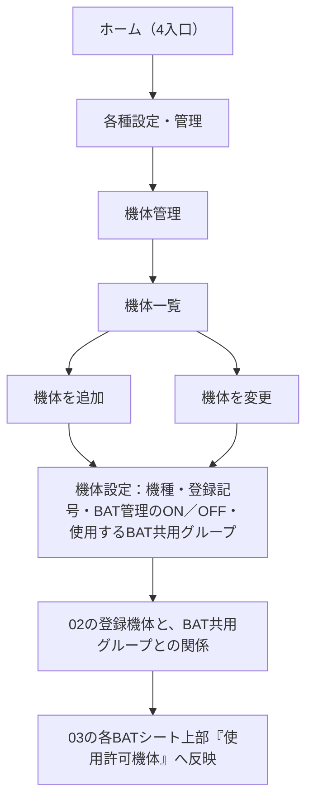

# 34g. 各種設定・管理の機体管理と、現在の運用環境・対象機体の表示責任

最終更新: 2026-09-21\
状態: 現在の運用環境と対象機体が別の情報であること、環境の表示・切替、4入口、Googleアカウントの扱いは既存の設計ベースライン（CURRENT-ACCEPTED）への接続。機体管理の入口の流れ、対象機体を確認できる方向、各種設定・管理が現在の環境を対象にすることは現在案（CURRENT-PROPOSAL）。画面の配置・レイアウトは未確定（`PENDING`）\
主責務: ［各種設定・管理］から機体管理へ進む画面の流れと責任、現在の運用環境の表示と対象機体の表示の責任の区別。関係の意味は[32h](../asset-management/32h_registered-aircraft-and-battery-group-relations.md)、環境の表示条件は[31a §4](../identity-and-access/31a_person-account-and-environment.md#4-会社利用と環境切替へ詰めた内容)・[34a §5](34a_setup-and-environment-entry.md#5-通常起動と環境選択の10項目)、対象機体を扱う各画面は[35b](../operation-recording/35b_normal-operation-and-final-save.md)\
由来: オーナーの2026-09-20の検討内容（会話。ファイルではない）\
入口: [Presentation設計の入口](README.md)

## 1. 位置づけ

**ホームの4入口は変更しない**（[34b §1](34b_home-and-navigation.md#1-2入口から3入口4入口へ進んだ因果)）。［新規飛行］［飛行リスト］［飛行履歴・出力］［各種設定・管理］がCURRENT-ACCEPTEDのままである。ホームを、個人・会社・スクール等の3ボタンへ戻す変更でもない。過去の3入口の時期があったことは、34b §1のHISTORICALに記録されている。

今回の内容は、既存のOperationalEnvironmentの表示・切替と、ホームの4入口を維持したまま、［各種設定・管理］から機体とBATの関係を管理できるようにすることである。2026-09-22の訂正（[34a §7.8](34a_setup-and-environment-entry.md#78-ホームへ入る前を最小にした訂正2026-09-22)）で、［各種設定・管理］は、機体・人員・許可承認・保険・現場プリセットなどを**必要になる前に登録しておく入口**でもある。2026-09-23の訂正（[34a §9.3](34a_setup-and-environment-entry.md#93-初回登録は1画面にまとめる)）で、自分の情報とDIPSのログイン情報は初回登録（はじめの登録）で登録し、ここからは**あとから確認・変更する**入口とする。機体・許可承認・保険をホームへ入る前に一括で登録させる構成は採らない。使う場所（個人・会社・団体）の追加・切替もここから行える（34a §9.4・§9.6）。画面ごとの10項目は[30の規約](30_screen-specification-standard.md)に沿い、未確定は`PENDING`とする。

## 2. 現在の運用環境の表示と対象機体の表示

**CURRENT-ACCEPTED**: 「今どの運用環境を操作しているか」と、「今どの実機を対象にしているか」は別の情報であり、画面上で混同しない。

| 項目 | 現在の運用環境 | 対象機体 |
|---|---|---|
| 示すもの | 今どの運用環境（個人・会社・スクール等）を操作しているか。必要なら使用中のGoogleアカウントを併記 | 今どの実機を扱っているか |
| 決まる時点 | 起動・環境の切替（34a §5） | 飛行計画で機体が確定した後 |
| ホームを開いた時 | 複数環境に所属する場合は現在環境と切替手段を明示。所属が1つなら常時表示を省略できる（31a §4） | まだ選択されていない場合がある |
| 正本 | 31a §4、34a §5 | 各画面の10項目（35b）と本書 |

```text
会社Aで使用中
ログイン中のGoogleアカウント：（必要なら併記）

対象機体
EVO Lite+ / JU*********
```

上の表の見出し「現在の運用環境」は内部の概念名（設計上の区別）である。利用者向けの画面は、この見出しを使わず、使っている先の名称で「会社Aで使用中」のように示す（2026-09-21の訂正。[34h §2](34h_user-facing-wording-and-terminology.md#2-内部の概念名と利用者向け表示案の対応)）。「現在の運用環境」と「対象機体」が別の情報であるという責任の区別は変えない。

ホームを開いただけでは、飛行の対象機体がまだ選択されていない場合がある。そのため、ホームに特定の「現在機体」を常時表示する仕様は、今回確定しない。

**CURRENT-PROPOSAL**: 機体を選択した後の画面では、利用者が「今どの実機を扱っているのか」を取り違えないようにする。表示は、機種名だけでなく、実機を識別できる登録記号まで確認できる方向とする（例: 「対象機体 EVO Lite+ / JU*********」）。既存の設計でも、対象機体を表示する責任がある画面があり、今回はこれを、対象機体が確定している画面へ接続する。

| 画面 | 既存の対象機体の表示 | 今回の接続 |
|---|---|---|
| 飛行計画で機体が確定した後（新規飛行の計画入力〜通報内容の確認） | Manual入力支援では機体登録記号を項目として表示する（[25b](../dips-flight-plan/25b_manual-web-mapping.md)）。対象機体を画面全体で常に示す責任は未定義 | 対象機体を確認できる方向 |
| 飛行前点検（[35b §3](../operation-recording/35b_normal-operation-and-final-save.md#3-飛行前点検の10項目)） | 対象機体を表示する | 機種と登録記号 |
| 離陸待機（35b §4） | 対象機体・運航文脈を表示する | 機種と登録記号 |
| 飛行中（35b §5） | 明示なし | 対象機体を取り違えない表示 |
| 着陸後入力（35b §6） | 明示なし | 対象機体を取り違えない表示 |
| BAT交換（35b §7） | 対象機体と互換のBAT個体を出す（機体は条件） | 対象機体を先に明示し、その機体に使用が許可されたBATだけを出す（[32h §8](../asset-management/32h_registered-aircraft-and-battery-group-relations.md#8-飛行時のbat選択候補案)） |
| 機体交代（35b §8） | 交代対象と対象機体の点検状況を表示する | 交代の前後の実機を取り違えない表示 |
| 飛行後点検（35b §9） | 使用機体を表示する | 機種と登録記号 |

**PENDING-D-AC-CONTEXT-DISPLAY**: 対象機体の表示を、ヘッダーのどの位置に置くか、固定表示にするか等の具体のレイアウト。ホームに現在機体を常時表示するかも含め、今回は決めない。現在の運用環境の表示位置と切替UIの配置は、既存のPENDING-S2-ENVIRONMENT-UI（31a・34a）に従う。

## 3. 各種設定・管理から機体管理へ（案）

**CURRENT-PROPOSAL**: ［各種設定・管理］を、機体の登録とBATとの関係の設定を行う、アプリ上の入口にする方向で検討している。

これは、Google Driveの中身を直接触るファイルマネージャーを作ることではない。利用者は、Driveのファイル名・セルの位置・Spreadsheetの構造を知らなくても操作できるようにする。アプリ上の操作の結果として、裏側のDrive上の正本（02の登録機体と実機・BAT共用グループの関係、03の各BATシートの表示）が更新される（[32h §4](../asset-management/32h_registered-aircraft-and-battery-group-relations.md#4-実機とbat共用グループの関係案)）。



機体設定として、機種、登録記号、BAT管理のON／OFF、使用するBAT共用グループ等を設定する方向である（最終の項目は未確定）。BAT管理のON／OFFを機体の登録時または機体設定から設定する方向は32h §7、どの画面で変更するかと変更時の履歴の扱いは32eのPENDING-D-BAT-SWITCH。

### 3.1 機体一覧

| 番号 | 記録項目 | 現在の内容・未確定 |
|---|---|---|
| 1 | 目的 | 現在の運用環境に登録された実機を確認し、追加・変更へ進む |
| 2 | 入口・入れる条件 | ホームの［各種設定・管理］→［機体管理］。現在の運用環境が選択済みであること。操作の権限は31b・PENDING-D-AC-PERMISSION |
| 3 | 表示情報 | 現在の運用環境（どの環境の機体か）、登録済み実機の一覧（機種と登録記号）、各機体のBAT管理ON／OFFと関係するBAT共用グループ（案）。最終の列は未確定 |
| 4 | 初期値・自動入力 | 現在の運用環境の登録機体。他の運用環境の機体を混ぜない |
| 5 | 主操作・副操作 | 主: 機体を選んで変更する、［機体を追加］。副: 未確定 |
| 6 | 操作後の遷移 | 追加・変更は§3.2へ。戻るで［各種設定・管理］へ |
| 7 | 戻る・中止・削除 | 機体の退役・削除等の扱いは未確定（12bのstatusとの対応はPENDING-C1-SCHEMA）。一覧からの削除で、過去の運航記録を失わせる設計にはしない |
| 8 | 保存・更新時点 | 操作の結果として02・03のDrive上の正本が更新される。更新と同期の時点は[38b](../sync-and-cache/38b_confirmation-and-sync-timing-separation.md)に従い、詳細は未確定 |
| 9 | 権限・online/offline差 | 三層は31b。機体管理の権限はPENDING-D-AC-PERMISSION。offlineでの操作は未確定 |
| 10 | 未確定 | 列・並び・レイアウト（PENDING-D-AC-SCREENS） |

### 3.2 機体の追加・変更

| 番号 | 記録項目 | 現在の内容・未確定 |
|---|---|---|
| 1 | 目的 | 実機を登録し、BAT管理の有無と、使用するBAT共用グループとの関係を設定する |
| 2 | 入口・入れる条件 | 機体一覧の［機体を追加］、または登録済み機体の選択 |
| 3 | 表示情報 | 現在の運用環境と、機体設定（機種・登録記号・BAT管理のON／OFF・使用するBAT共用グループ等。最終は未確定） |
| 4 | 初期値・自動入力 | 対象は現在の運用環境。BAT管理の既定値は未確定（PENDING-D-BAT-SWITCH） |
| 5 | 主操作・副操作 | 主: 保存（登録）。副: 未確定。BAT共用グループの設定を別の画面にするかは未確定 |
| 6 | 操作後の遷移 | 保存後は機体一覧へ |
| 7 | 戻る・中止・削除 | 中止した場合は登録しない。誤登録の解除等は未確定（PENDING-D-AC-UNLINKED-EXCEPTION） |
| 8 | 保存・更新時点 | 登録結果が02へ、BAT共用グループとの関係が関係の正本へ反映され、BATシートの使用許可機体の表示へ反映される。BATシートを直接編集しない（32h §6） |
| 9 | 権限・online/offline差 | 31b・PENDING-D-AC-PERMISSION。offlineでの登録は未確定 |
| 10 | 未確定 | 追加・変更それぞれのレイアウト、BAT共用グループ設定画面（PENDING-D-AC-SCREENS）、BAT管理ON／OFFの変更画面と履歴の扱い（PENDING-D-BAT-SWITCH） |

**PENDING-D-AC-SCREENS**: 機体追加・機体変更・BAT共用グループ設定の各画面の具体レイアウトと、機体一覧の列・並び。各種設定・管理の他の分類（人員・BAT・場所・環境等）は、[34f](34f_screen-map-and-design-coverage.md)のPENDING-D-SETTINGS-SCREENSのまま未設計。

## 4. 各種設定・管理が対象にする運用環境

**CURRENT-PROPOSAL（既存の原則の適用）**: ［各種設定・管理］を開いた場合も、現在選択中の運用環境を明確にし、その環境を対象にする。現在「会社A」を利用中なら会社Aの機体管理を編集し、個人環境へ切り替えれば個人環境の機体管理を編集する。違う環境の機体を誤って追加・変更しないよう、現在の環境との関係を画面設計上も維持する（環境ごとの正本の切替は31a §4・34a §5）。

ホーム上部の具体の配置、設定画面での環境の表示位置、環境切替ボタンの形は、今回決めない（PENDING-S2-ENVIRONMENT-UI、PENDING-D-AC-SCREENS）。

## 5. 会社等の分業との接続

既存の設計（CURRENT-ACCEPTED）では、DIPS通報と実飛行を別の時点で行える。会社の事務担当者が［新規飛行］から飛行計画を作りDIPS通報まで進め、作業を一度区切る。後から飛行する操縦者が、［飛行リスト］で通報済み計画を選び、DIPS通報内容を確認して飛行前点検へ進む（[31c §3](../identity-and-access/31c_operational-actors.md#3-さらに通報者と操縦者を分離した理由)、[34c](34c_shared-flight-worklist.md)、[34d](34d_dips-accepted-and-plan-content.md)）。

**CURRENT-PROPOSAL**: 機体管理・BAT設定も、複数人が関わる運用へつなぐ。事務担当者や管理担当者が権限を持っていれば、［各種設定・管理］→［機体管理］→新規機体の登録→BAT共用グループとの紐付けを、事前に行える構造が考えられる。ただし、「事務員なら必ず機体を追加できる」という権限のルールは作らない。三層（業務上の役割・アプリ機能権限・Google Driveの実アクセス。[31b](../identity-and-access/31b_roles-and-access-control.md)）を維持し、誰が何を変更できるかはPENDING-D-AC-PERMISSION（[32h §9](../asset-management/32h_registered-aircraft-and-battery-group-relations.md#9-会社等の分業権限との接続)）とする。

## 6. GoogleアカウントとOperationalEnvironment

**CURRENT-ACCEPTED（既存。維持する）**: 同じ人物が、個人用のGoogleアカウントと会社のGoogle／Workspaceアカウント等を持つことがある。Googleアカウントそのものを、OperationalEnvironmentや人物そのものと同一視しない（[31a §2](../identity-and-access/31a_person-account-and-environment.md#2-現在の概念境界とorganization)）。複数の環境に所属する場合は、現在の環境と、必要なら現在のGoogleアカウントを、利用者が確認できる（31a §4）。今回、ログイン方式やアカウントの切替方式は新しく決めない。

## 7. 未確定と再検討条件

- PENDING-D-AC-CONTEXT-DISPLAY（§2）、PENDING-D-AC-SCREENS（§3）は本書が定義する。
- 他の文書が定義する未確定: PENDING-D-AC-PERMISSION・PENDING-D-AC-REGISTRY-STORAGE・PENDING-D-AC-PERMITTED-DISPLAY・PENDING-D-AC-UNLINKED-EXCEPTION・PENDING-D-AC-GROUP-NAMING（[32h](../asset-management/32h_registered-aircraft-and-battery-group-relations.md)）、PENDING-D-BAT-SWITCH（[32e](../asset-management/32e_battery-management-scope-and-flight-separation.md)）、PENDING-S2-ENVIRONMENT-UI（31a）、PENDING-S5-HOME-DETAIL（34b。各種設定・管理の分類）。

**再検討条件**: 対象機体の表示が現場で取り違えの防止に足りない場合、機体管理を［各種設定・管理］の入口に置く流れが運用に合わない場合、環境の切替と機体の設定を取り違える事故が起きた場合。
