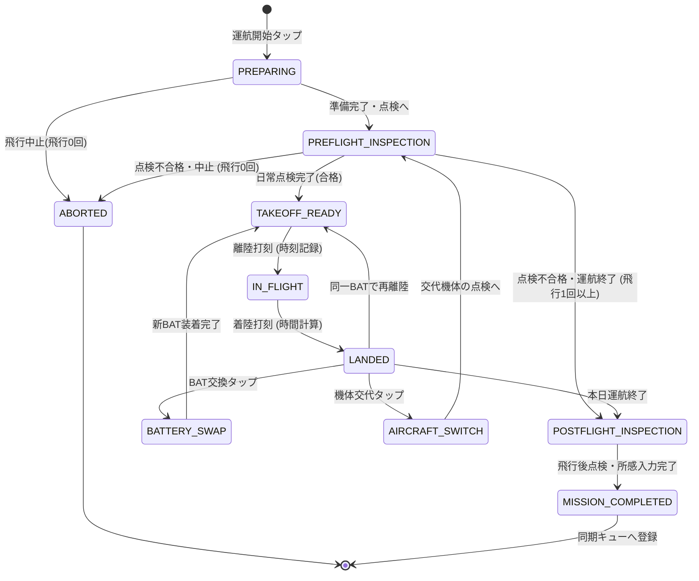

# 13a. 現場運航状態マシン

最終更新: 2026-09-18\
状態: Phase C0完了・Phase C1未着手（docs再編）

主要責務: 通信状態に依存しない現場作業・点検・離着陸・交換の進行。

## 1. 運航状態マシン（Operation State Machine）

現場での操縦者の操作負荷を極小化し、現行アプリ（`autel-evo-lite-flight-log`）の俊敏な現場打刻フローを完全に継承・強化した状態遷移を定義します。

### 1.1. 状態遷移図（Mermaid）

`ABORTED` への遷移は飛行0回の場合に限る。機体交代後の点検不合格など、既に飛行実績がある状態で運航を終了する場合は、既存のFlight・交代・点検記録と終了理由を保持し、飛行済み機体の `POSTFLIGHT_INSPECTION` を経て `MISSION_COMPLETED` へ進む。

### 1.2. 各状態の定義と現場操作

| 状態名 (State) | 説明・システム挙動 | 現場でのUI操作 | 保存されるデータ |
|---|---|---|---|
| **`PREPARING`** | 運航セッションの開始。機体・パイロット・現場天候・場所の確認。 | 機体選択、現場選択 | `Mission` レコード作成 |
| **`PREFLIGHT_INSPECTION`** | 航空法第132条の89、航空法施行規則第236条の84、および無人航空機の飛行日誌の取扱要領に基づく飛行前日常点検（航空法第132条の86の飛行前確認事項を含む）。 | チェック項目確認、「全項目正常」または異常メモ | `PreflightInspection` |
| **`TAKEOFF_READY`** | 離陸待機状態。画面中央に大きな「離陸」ボタンを配置。 | 片手タップで即離陸 | なし（画面待機） |
| **`IN_FLIGHT`** | 飛行中。ストップウォッチがカウントアップ。 | 画面中央に大きな「着陸」ボタン | `Flight` (離陸時刻) |
| **`LANDED`** | 着陸直後。飛行時間を自動計算表示。次アクション選択待機。 | 次飛行／BAT交換／終了 | `Flight` (着陸時刻・飛行時間) |
| **`BATTERY_SWAP`** | バッテリー交換。次スロットのバッテリーをワンタップ選択。 | 登録済み互換バッテリーのPickerをタップ | 次の `Flight.battery_id` 選択・切替（飛行使用履歴はFlightから導出） |
| **`AIRCRAFT_SWITCH`** | 機体交代。予備機または別機種へ切り替え。 | 機体選択タップ | `AircraftSwitch` 記録 |
| **`POSTFLIGHT_INSPECTION`** | 運航完了後の日常点検、機体清掃、総所感入力。 | 点検チェック、所感入力 | `PostflightInspection` |
| **`MISSION_COMPLETED`** | 本運航セッション確定。ローカル確定マーク付与。 | 「台帳同期」ボタン表示 | `Mission` (確定状態・同期ジョブ) |
| **`ABORTED`** | 天候悪化や機体異常による飛行0回での現場中止。 | 中止理由選択 | `Mission` (中止記録) |

### 1.3. 特殊シナリオへの対応
1. **8回以上の連続飛行**: 配列構造として `Flight` を保持するため、8回、10回などの複数回飛行でも制限なく記録可能。
2. **日跨ぎ飛行**: 日時フィールドをISO8601（UTC+オフセット、秒・ミリ秒精度）で保持し、日付変更線を跨ぐ運航でも正確に飛行時間を算出。
3. **不意の強制終了・再起動**: すべてのイベント（離陸打刻、着陸打刻等）が端末ローカル下書きとして即時保護されるため、飛行中にブラウザが閉じても、再開時に直前の状態（`IN_FLIGHT` 等）へ確実に復帰。

## 2. 通常進行のGateと実際の離陸記録

状態図は通常の案内経路を示す。点検未実施・不合格では通常の `TAKEOFF_READY` 案内へ進めないが、操縦者が既に離陸した事実の記録は拒否しない。実際の離着陸記録を残し、警告と必要な監査イベントを [13c](13c_takeoff-readiness.md) に従って別途記録する。飛行中のバッテリー交換など成立しない操作と、既に発生した事実の記録を区別する。

機材の個数や表示番号は固定しない。機体・バッテリーの互換と飛行使用履歴の正本は [12b](../domain-model/12b_aircraft-and-battery.md)、Mission/Flight属性は [12e](../domain-model/12e_operation-inspection-maintenance.md)。

---

## 3. 運航データの保存・反映境界（ローカル下書き保護と最終確定送信）

現場運航におけるデータの保存と台帳反映は、操縦者の操作負担を排除するため以下の二段階の境界で実行されます。

1. **現場進行中のローカル下書き保護**:
   - 飛行前点検、離陸・着陸打刻、BAT交換、機体交代等の現場操作は、通信状態に関わらず端末ローカル下書きとして即時保護されます。
   - 画面遷移を進んだだけでGoogle Drive上の確定台帳（A4シート等）へ都度確定保存されることはなく、オフライン現場での操作継続性を担保します（具体的な端末保存技術はPhase C1へ保留）。
   - BAT交換（同一ミッション継続）や機体交代（ミッション文脈引継ぎ）の既存分岐構造はそのまま維持されます。
2. **飛行後点検後の最終送信による確定一括反映**:
   - 操縦者が飛行後点検・所感を完了し、最後に［送信／保存］を実行した時点で、確定した運航データが一括反映されます。
   - この一括反映により、原本を複製したA4運航記録シート（日付・連番シート）の自動記入、バッテリー使用実績・回数の更新、および機体累計飛行時間の派生更新が自動的に行われます（操縦者に手動転記を求めません）。
