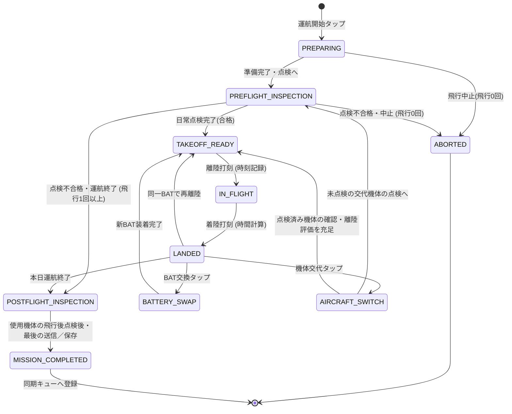

# 13a. 現場運航状態マシン

最終更新: 2026-09-18\
状態: Phase C0完了・Phase C1未着手（docs再編）

主要責務: 通信状態に依存しない現場作業・点検・離着陸・交換の進行。

Step 5のホーム入口は[34b](../presentation/34b_home-and-navigation.md)、通報済み計画の選択は[34c](../presentation/34c_shared-flight-worklist.md)、点検への通常画面接続は[34d](../presentation/34d_dips-accepted-and-plan-content.md)。下図の「運航開始」は現場状態の開始であり、ホームの新規／続行を一つの入口へ統合する指定ではない。Step 6の通常操作画面の因果・10項目仕様は[35b](../operation-recording/35b_normal-operation-and-final-save.md)、保存責任は[35d](../operation-recording/35d_operation-finalization-and-write-boundary.md)。以下は論理状態であり、画面数や最終schemaとは区別する。

## 1. 運航状態マシン（Operation State Machine）

現場での操縦者の操作負荷を極小化し、現行アプリ（`autel-evo-lite-flight-log`）の俊敏な現場打刻フローを完全に継承・強化した状態遷移を定義します。

### 1.1. 状態遷移図（Mermaid）

`ABORTED` への遷移は飛行0回の場合に限る。機体交代後の点検不合格など、既に飛行実績がある状態で運航を終了する場合は、既存のFlight・交代・点検記録と終了理由を保持し、飛行済み機体の `POSTFLIGHT_INSPECTION` を経て `MISSION_COMPLETED` へ進む。

### 1.2. 各状態の定義と現場操作

保存欄のMission等の型名は既存候補を示す。意味と最終schemaの境界は35a／12eに従い、画面進行を根拠に採用を確定しない。

| 状態名 (State) | 説明・システム挙動 | 現場でのUI操作 | 保存されるデータ |
|---|---|---|---|
| **`PREPARING`** | 運航セッションの開始。機体・パイロット・現場天候・場所の確認。 | 機体選択、現場選択 | `Mission` レコード作成 |
| **`PREFLIGHT_INSPECTION`** | 航空法第132条の89、航空法施行規則第236条の84、および無人航空機の飛行日誌の取扱要領に基づく飛行前日常点検（航空法第132条の86の飛行前確認事項を含む）。 | チェック項目確認、「全項目正常」または異常メモ | `PreflightInspection` |
| **`TAKEOFF_READY`** | 離陸待機状態。画面中央に大きな「離陸」ボタンを配置。 | 片手タップで即離陸 | なし（画面待機） |
| **`IN_FLIGHT`** | 飛行中。ストップウォッチがカウントアップ。 | 画面中央に大きな「着陸」ボタン | 飛行明細（離陸時刻、物理schemaは35aのPENDING） |
| **`LANDED`** | 着陸直後。飛行時間を自動計算表示。次アクション選択待機。 | 着陸後の補足入力、続行／BAT交換／機体交代／終了 | 飛行明細（着陸時刻・飛行時間・BAT・場所・安全事項） |
| **`BATTERY_SWAP`** | バッテリー交換。次に使う互換BAT個体を選択（固定スロットではない）。 | 登録済み互換バッテリーのPickerをタップ | 次の明細で使うBATの選択・切替（最終schemaは35a） |
| **`AIRCRAFT_SWITCH`** | 機体交代。予備機または別機種へ切り替え。 | 機体選択タップ | 文脈を継承する交代事実（独立Entity化は35aのPENDING） |
| **`POSTFLIGHT_INSPECTION`** | 運航完了後の日常点検、機体清掃、総所感入力。 | 点検チェック、所感入力 | `PostflightInspection` |
| **`MISSION_COMPLETED`** | 本運航セッション確定。ローカル確定マーク付与。 | 最後の送信／保存後の状態表示（外部反映済みとは限らない） | `Mission` (確定状態・同期ジョブ) |
| **`ABORTED`** | 天候悪化や機体異常による飛行0回での現場中止。 | 中止理由選択 | `Mission` (中止記録) |

### 1.3. 特殊シナリオへの対応
1. **8回以上の連続飛行**: 内部明細を保持し、A4の7枠をDomainの回数上限にしない。意味は35a、シート分割は35c、物理schemaは未確定。
2. **日跨ぎ飛行**: 日時フィールドをISO8601（UTC+オフセット、秒・ミリ秒精度）で保持し、日付変更線を跨ぐ運航でも正確に飛行時間を算出。
3. **不意の強制終了・再起動**: すべてのイベント（離陸打刻、着陸打刻等）がIndexedDBに即時同期されるため、飛行中にブラウザが閉じても、再開時に直前の状態（`IN_FLIGHT` 等）へ確実に復帰。

## 2. 通常進行のGateと実際の離陸記録

状態図は通常の案内経路を示す。点検未実施・不合格では通常の `TAKEOFF_READY` 案内へ進めないが、操縦者が既に離陸した事実の記録は拒否しない。実際の離着陸記録を残し、警告と必要な監査イベントを [13c](13c_takeoff-readiness.md) に従って別途記録する。飛行中のバッテリー交換など成立しない操作と、既に発生した事実の記録を区別する。

機材の個数や表示番号は固定しない。機体・バッテリーの互換と飛行使用履歴の正本は [12b](../domain-model/12b_aircraft-and-battery.md)、Mission/Flight属性は [12e](../domain-model/12e_operation-inspection-maintenance.md)。

旧図は機体交代で常に正式点検へ戻る候補だった。§5の「未点検機体だけ正式な飛行前点検」との接続を明示した。点検済みであることだけで安全評価を省略せず13cを適用する。画面の確定・通信結果をFSM一軸に統合しない。
