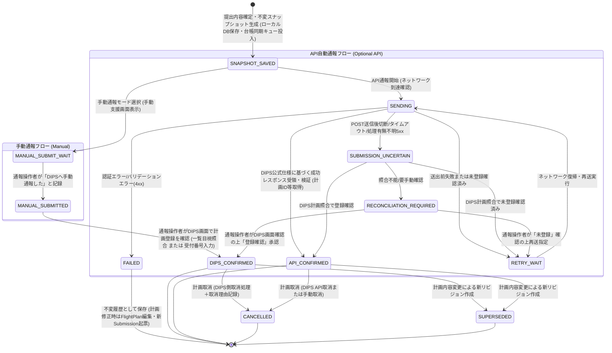

# 13b. DIPS提出状態マシンと誤認防止

最終更新: 2026-09-18\
状態: Phase C0完了・Phase C1未着手（docs再編）

主要責務: DipsSubmissionStatusの全状態・遷移・確認境界。Entity属性は12d、通報要否・安全評価は13cを参照する。

Step 4で移管したAPI非依存・結果不明時の再POST禁止の因果は[33b](../dips-infrastructure/33b_api-availability-and-retry-boundaries.md)。Step 5で正常受付後・共有リストの限定した画面を[34c](../presentation/34c_shared-flight-worklist.md)／[34d](../presentation/34d_dips-accepted-and-plan-content.md)へ移した。状態名・全遷移は保持し、重複調整・照合UI等の§7全体を再移植済みとは扱わない。

## 1. DIPS通報状態マシン（DIPS Notification State Machine - B2.3改訂）

APIの有無（手動通報 / API自動通報）にかかわらず、提出予定スナップショットのローカル永続化、手動入力支援、送信成否、そして「通報操作者による手動通報操作」と「DIPS側の登録確認」を明確に分離した状態追跡を行います。通報操作者（SubmissionActor）と実際の操縦者の区別は [12a](../domain-model/12a_organization-and-personnel.md) に従います。
また、**「DIPS通報状態（Submission State）」と「外部台帳同期状態（Ledger Sync State）」は直交する別軸として管理**し、スプレッドシート同期の完了有無がDIPS通報手続きをブロックしない設計とします。

### 1.1. 状態遷移図（Mermaid）

図は通常のManual/API経路を示し、`SYSTEM_OUTAGE_EXCEPTION` は省略する。障害例外の記録条件は [13c](13c_takeoff-readiness.md)、状態の定義は本書§1.2、事後通報への接続は [§2](#2-台帳同期手動確認との接続) を参照する。

### 1.2. 各状態の定義と現場UI挙動

※飛行計画の作成・編集中は `FlightPlan.plan_status = 'draft'` で管理され、提出内容を確定して不変スナップショット（`submission_snapshot`）を生成した時点で初めて `DipsSubmission` が起票されます。したがって、Submission状態マシンは初期状態 **`SNAPSHOT_SAVED`** から始まります。

| 状態名 (State) | 説明 | ユーザーへのUI表示 | 次の遷移 |
|---|---|---|---|
| **`SNAPSHOT_SAVED`** | 提出不変スナップショット（`submission_snapshot`）が端末ローカルDBへ保存され、通報準備が完了した状態（同時に外部台帳同期キューへ投入）。※Google Sheets同期完了は待たない。 | **「通報準備完了（DIPS未通報）」** | 手動通報またはAPI通報へ |
| **`MANUAL_SUBMIT_WAIT`** | 手動入力支援画面を表示中。通報操作者がDIPS Web/アプリで登録済項目の選択、checkbox、数値・日時入力、必要箇所のコピーを行っている待機状態。 | 「手動通報待機中（DIPSへ入力してください）」 | `MANUAL_SUBMITTED` |
| **`MANUAL_SUBMITTED`** | 通報操作者がアプリ上で「DIPS手動通報を完了した」と記録打刻した状態。**※DIPS側の登録・受理確認ではない**。 | **「手動通報実施を記録（DIPS登録確認待ち）」** | `DIPS_CONFIRMED` |
| **`DIPS_CONFIRMED`** | 通報操作者がDIPS画面で計画登録を確認した状態（飛行計画一覧との目視照合、または受付番号の確認入力）。 | **「DIPS通報確認完了（手動確認済）」** | 運航完了 / 取消 / 訂正 |
| **`SENDING`** | バックエンド経由で国交省DIPS APIとHTTP通信中。 | 「DIPS API通報中...（通信中）」 | 成功/失敗/結果不明 |
| **`API_CONFIRMED`** | DIPS公式API仕様で定義された成功レスポンスを受領し、受付番号/計画ID等の必要条件がシステム的に自動確認された状態。 | 正常受付後・重複なしの表示は[34d](../presentation/34d_dips-accepted-and-plan-content.md)、リスト表示は34cを参照 | 運航完了 / 取消 / 訂正 |
| **`SUBMISSION_UNCERTAIN`** | API送出後に通信切断・タイムアウトが発生し、登録成否が不明な状態。**自動再POSTは行わない**。 | 「通報結果照合中...（二重登録防止のため照合中）」 | DIPS計画検索照合へ |
| **`RECONCILIATION_REQUIRED`**| API照合でも成否を判定できず、通報操作者によるDIPS Web画面での目視確認を要求する状態。 | 「要確認: DIPS登録状況を照合できません。DIPS画面で確認してください」 | 通報操作者の確認入力 |
| **`FAILED`** | バリデーションエラーや恒久拒否（4xx）。不変履歴としてそのまま保存（下書きへの巻き戻しやpayload改変は不可）。 | 「通報失敗: 計画を修正して再作成してください」 | 履歴保存（FlightPlan修正・新Submission起票へ） |
| **`RETRY_WAIT`** | 送出前の通信不成立、または照合で未登録を確認した後の再送待機。処理有無が不明な5xxはここへ直行せず照合する。 | 「一時通信エラー: 再送待機中」 | `SENDING` |
| **`SUPERSEDED`** | 時間変更や機体変更により、新しいリビジョンが起票され、旧提出スナップショットが無効化された状態。 | 「旧版（リビジョン更新により差し替え済み）」 | 履歴保持のみ |
| **`CANCELLED`** | 当該飛行計画を取り消した状態（DIPS側取消手続きと取消日時・理由記録）。 | 「計画取消済み（取消理由: XXXXX）」 | 履歴保持のみ |
| **`SYSTEM_OUTAGE_EXCEPTION`** | 国交省公式通報システム障害により、飛行開始前の通報が物理的に不可能な状況において、操縦者が障害例外事由・メモを添えて記録した状態（着陸後速やかに事後通報を行う）。※アプリによる自動判定は禁止。 | **「DIPS事前通報未完了（国交省システム障害例外記録あり・着陸後速やかに通報）」** | 運航完了後の事後通報へ |

> [!IMPORTANT]
> **状態と法的解釈の混同防止原則（5大ルール）**:
> 1. **「SNAPSHOT_SAVED（スナップショット保存済）」≠「DIPS通報済み」**: 端末ローカルDBやスプレッドシート台帳に保存されても、DIPSへは未提出です。また、台帳同期状態（`sync_status`）とDIPS通報状態（`status`）は別軸として画面上も区別表示します。
> 2. **「MANUAL_SUBMITTED（手動通報記録）」≠「DIPS確認済み」**: 通報操作者がボタンを押しただけではDIPS側の登録証明にはならず、一覧照合目視確認または受付番号確認（`DIPS_CONFIRMED`）を別ステップとして要求します。
> 3. **「API_CONFIRMED」と「DIPS_CONFIRMED」の区別**: システム自動検証（API）か人間による目視確認（手動）かを監査ログ・台帳上で明確に識別可能とします。
> 4. **「MOCK成功」≠「実通報成功」**: 開発・テスト用のMock DIPS Adapterで成功しても、本番通報済みとは表示せず、「[MOCK] 疑似通報完了」と画面上明記します。
> 5. **「通報完了」≠「飛行可能」**: DIPS通報はいかなる状態であっても飛行許可そのものではありません。「飛行計画通報完了。飛行前に周囲の安全・気象・許可条件を必ず確認してください」と表示します。

## 2. 台帳同期・手動確認との接続

提出状態 `status` と台帳同期 `sync_status` は別軸。ローカル保存・外部台帳同期待ち/同期済みは [24a](../dips-submission/24a_submission-and-sheets-ledger.md) の保存表示を用い、Google Sheets同期完了をDIPS通報の必須条件にしない。

`DIPS_CONFIRMED` は `confirmation_method: displayed_id`（表示された番号を確認入力）または `flight_plan_list_match`（日時・機体・範囲の一覧目視照合）で成立する。後者は `dips_plan_id: null` を許容する。`API_CONFIRMED` は `api_response` によるシステム確認として区別する。操作ボタン/確認欄の仕様は [25b](../dips-flight-plan/25b_manual-web-mapping.md)。

`SYSTEM_OUTAGE_EXCEPTION` の記録条件と法令保証をしない表示は [13c](13c_takeoff-readiness.md) が正本。通常FSMの初期状態は `SNAPSHOT_SAVED` であり、まだSubmissionがない `NOT_SUBMITTED` 等の表示を永続状態へ混入させない。障害例外後の事後通報では同じ提出内容を確認してManual/API経路へ進み、内容を修正する場合は新Submissionを作成する。

基準のAPI成功時表示は「DIPS通報完了（API自動受理・受付番号: XXXXX）」であった（HISTORICAL）。Step 5では34dに正常応答後の選択を具体化した。これはAPI_CONFIRMEDの意味や「通報完了≠飛行可能」を変更するものではない。内部状態だけから重複なしや外部共有書込み成功まで推定せず、UI条件は34d、保存軸は24aに従う。
